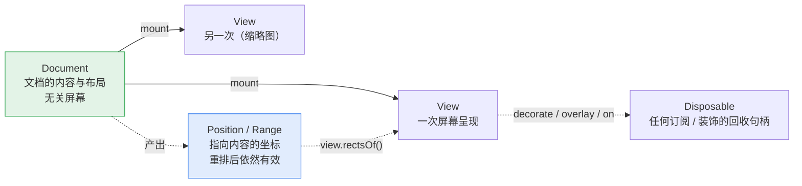

# API 设计

> 配套文档：[架构设计](./architecture.md)（内部怎么切）· [开发计划](DEVELOPMENT-PLAN.md)（什么顺序做）
>
> 本文是**设计**文档，不是使用手册——除标 🟢 外，下述 API 尚未实现。
> 标注含义：🟢 已可用 · 🟡 签名已定，待实现 · ⚪ 形状待定

**这个库的卖点不只是「能把 docx 画出来」，而是「画出来之后你能对它做事」**——
定位到某段、在它旁边挂个 React 批注、填模板、导回 docx。
所以 API 设计的重心在**查询、定位、装饰、锚定**这四件事上，而不是加载参数有多少个。

---

## 1. 快速开始

```ts
import { UltimateWord } from 'ultimate-word';

const doc = await UltimateWord.load(arrayBuffer);
const view = doc.mount('#container');
```

两行。其余一切都是可选的。

---

## 2. 心智模型

只有四个概念，理解了这四个就能用全部 API。



**① `Document`——内容 + 布局，不关心屏幕。**
加载一次、排版一次。`doc.pageCount` 是文档的固有属性，不是某个视图的属性。

**② `View`——一次屏幕呈现。一个 Document 可以挂多个 View。**
主视图 + 缩略图侧栏共享同一份布局结果，因为缩放只是坐标变换，
不改变布局（[为什么](./architecture.md#41-一个重要推论缩放永不触发重排)）。
所以「缩略图」不需要第二次排版，几乎零成本。

**③ `DocPosition` / `DocRange`——指向内容的坐标，不是数字偏移。**
它在重排、编辑之后**依然有效**。这是它比 `{ start: 1234 }` 这种全局偏移值钱的地方：
你在第 3 段挂了个批注，用户在第 1 段插入一屏文字，批注还在第 3 段。

**④ `Disposable`——凡是「挂上去」的东西都能摘下来。**
装饰、overlay、事件订阅，一律返回 `{ dispose(): void }`。不提供 `removeXxx(id)` 这类对称 API，
因为句柄式回收在 React `useEffect` 里是一行 `return () => d.dispose()`，
而 id 式回收总有人忘记存 id。

---

## 3. 加载 🟡

```ts
namespace UltimateWord {
  function load(source: LoadSource, options?: LoadOptions): Promise<Document>;
}

type LoadSource = ArrayBuffer | Uint8Array | Blob | File | Response | string; // string = URL

interface LoadOptions {
  fonts?: FontOptions;
  /** 加载即排版（默认 true）。false 时首次 mount 或首次查询才排 */
  layoutOnLoad?: boolean;
  /** 布局跑在 Worker 里（默认 'auto'：文档 > 50 页时启用） */
  worker?: boolean | 'auto';
  /** 覆盖文档自带的页面设置，仅用于「按当前容器宽度重排」这类特殊场景 */
  pageSetup?: Partial<PageSetup>;
  signal?: AbortSignal;
}
```

`load` 是唯一的异步入口（要解压、解析、可能要 fetch 字体）。
**之后所有查询都是同步的**——布局结果已经在内存里，
`doc.find()` 没有理由返回 Promise。这条对调用方的心智负担差别很大。

---

## 4. 字体 🟡

字体是这个库保真度的地基，所以它有一个独立的、全局的注册表。

```ts
UltimateWord.fonts.register(family: string, data: ArrayBuffer): void;
UltimateWord.fonts.registerMetrics(pack: MetricsPack): void;
UltimateWord.fonts.substitute(map: Record<string, string>): void;
UltimateWord.fonts.status(family: string): 'file' | 'metrics' | 'fallback' | 'missing';
```

对应[三级降级策略](./architecture.md#53-度量的三级降级)：

```ts
// ① 有真实字体文件：度量与渲染都准
UltimateWord.fonts.register('FangSong', await fetch('/fonts/simfang.ttf').then(r => r.arrayBuffer()));

// ② 只有度量包：排版与 Word 一致（断行点、页数），字形用替代字体
UltimateWord.fonts.registerMetrics(await fetch('/metrics/fangsong.json').then(r => r.json()));
UltimateWord.fonts.substitute({ '仿宋_GB2312': 'Noto Serif CJK SC' });

// ③ 什么都没有：等宽近似，页数可能对不上
UltimateWord.fonts.status('方正小标宋简体'); // → 'missing'
```

`status()` 的四态里 `fallback` 与 `missing` 别搞反（`FontRegistry.status()` 的实际语义）：
**`fallback` = 替换表命中了另一款已注册的字体**（字形还算像，度量已经偏离 Word，
但注册一份度量包就能修好）；**`missing` = 什么都没命中**，走等宽近似。

> **随库那 17 款不需要调用方操心**：A/B/C/D 四类度量包已经入库
> （`packages/fonts/packs`，88 KB），`@uw/fonts/node` 的 `loadBundledPacks()` 一行注册进
> `FontRegistry`；门面包会在 `load()` 时替调用方做掉。上面的 `registerMetrics`
> 是给**清单之外**的字体用的（比如 `仿宋_GB2312`）。

> **级别③ 现在是等宽近似，不是 `canvas.measureText`**：canvas 是 DOM API，
> 而 `@uw/fonts` 在无 DOM 区（架构原则 1.2），调不到它。这个洞的三条出路见
> [架构 §5.3](./architecture.md#53-度量的三级降级)，Phase 3 再定归属。
>
> 门面的 `register(family, data)` 由 `@uw/fonts/decode` 的 `fontSourceFromBytes()` 实现，
> `registerMetrics(pack)` 对应 `FontRegistry.registerMetrics()`。分成子路径是为了让
> 只带度量包的部署不必把 fontkit 打进去。

> **为什么是全局注册表而不是每个文档传一遍**：字体解析和度量缓存是纯开销，
> 同一个页面开十份公文没有理由解析十次宋体。`LoadOptions.fonts` 仍可做**每文档覆盖**，
> 但默认继承全局。

---

## 5. 挂载与视图 🟡

```ts
doc.mount(target: string | HTMLElement, options?: ViewOptions): View;

interface ViewOptions {
  mode?: 'preview' | 'edit';           // 默认 'preview'
  zoom?: number | 'fit-width' | 'fit-page';
  pageGap?: number;                    // px
  /** 额外渲染一层原生可选文本，让 Ctrl+F / 划词复制 / 屏幕阅读器可用 */
  textLayer?: boolean;                 // preview 默认 true，edit 默认 false
  renderer?: 'dom' | 'canvas';         // 默认 'dom'
  /** 视口外多渲染几页（默认 2），调大更顺滑、更吃内存 */
  overscan?: number;
}
```

```ts
view.setZoom(1.5);
view.setZoom('fit-width');
view.dispose();                       // 摘掉所有 DOM、解绑所有事件
```

> **为什么 `textLayer` 在预览态默认开、编辑态默认关**：预览态用户期待 Ctrl+F 能搜到字；
> 编辑态有自己的选区系统，再叠一层原生可选文本会导致双重选区打架。

---

## 6. 位置与范围 🟡

```ts
interface DocPosition {
  readonly nodeId: NodeId;   // 稳定标识，不是数组下标
  readonly offset: number;   // 节点内的字符偏移
}

interface DocRange {
  readonly start: DocPosition;
  readonly end: DocPosition;
  text(): string;
  contains(other: DocPosition | DocRange): boolean;
  /** 屏幕矩形要问 View 要，因为那是屏幕空间的事 */
}

doc.compare(a: DocPosition, b: DocPosition): -1 | 0 | 1;
doc.rangeOf(node: NodeId): DocRange;
```

> **为什么不用「全局字符偏移」这种更省事的表示**：
> 全局偏移在任何编辑之后都会整体平移，你存下来的每个批注位置都会错位。
> `nodeId + offset` 只在**该节点自身**被编辑时才需要调整，
> 而这个调整由事务系统自动完成（见 §10）。

---

## 7. 查询与定位 🟡

四个方法覆盖「我想找到文档里的某个东西」的全部场景：

```ts
// ① 按结构找：类 CSS 选择器
doc.query('paragraph[styleId=Heading1]'): DocNode[];
doc.query('table > row:first-child cell'): DocNode[];
doc.query('sdt[tag=applicant]'): DocNode[];

// ② 按文本找
doc.find('签发人'): DocRange[];
doc.find(/第\s*\d+\s*条/g, { limit: 50 }): DocRange[];

// ③ 屏幕坐标 → 内容位置（命中测试）
view.locate({ clientX: 320, clientY: 540 }): DocPosition | null;

// ④ 内容位置 → 屏幕矩形（一个 range 跨行会有多个矩形）
view.rectsOf(range): DOMRect[];
```

支持的选择器（够用即止，不做完整 CSS）：

| 形式 | 含义 |
|---|---|
| `paragraph` `run` `table` `row` `cell` `image` `sdt` `field` | 按节点类型 |
| `[styleId=X]` `[tag=X]` `[alias=X]` | 按属性 |
| `A B` / `A > B` | 后代 / 直接子 |
| `:first-child` `:last-child` `:nth-child(n)` | 位置伪类 |

> **为什么 `locate` 和 `rectsOf` 在 `view` 上而不在 `doc` 上**：
> 它们涉及屏幕坐标，而屏幕坐标是**每个视图各不相同**的（缩放、滚动位置都不同）。
> 放 doc 上就必须回答「哪个视图的坐标」，那就是设计错误。
> 这正是[三个坐标空间](./architecture.md#4-三个坐标空间)那条约束在 API 表面的体现。

---

## 8. 装饰与锚定 🟡

**这是本库相对 docx-preview 之类最主要的增量能力。**

```ts
// 高亮 / 下划线 / 任意样式，不改文档内容
const d = view.decorate(range, {
  className: 'search-hit',
  style: { background: '#ffd33d55' },
  layer: 'below-text',                 // 'below-text' | 'above-text'
});
d.dispose();

// 把任意 DOM / React 组件锚到文档位置上，重排后自动跟随
const o = view.overlay(range.start, bubbleElement, {
  placement: 'right-of-line',          // 'right-of-line' | 'above' | 'below' | 'inline'
  offset: { x: 8, y: 0 },
  follow: true,                        // 重排 / 滚动 / 缩放后自动更新位置
});
o.update();                            // 手动重算（内容尺寸自己变了时）
o.dispose();
```

```ts
view.scrollTo(target: DocPosition | DocRange | { page: number }, options?: {
  align?: 'start' | 'center' | 'end';
  behavior?: 'auto' | 'smooth';
});
```

> **为什么装饰不是「往模型里插标签」**：装饰是**视图层**的东西。
> 插进模型会污染文档内容、进 undo 栈、被导出到 docx 里去。
> 分开之后，「同一份文档，A 用户看到自己的批注，B 用户看到自己的」是天然成立的。

---

## 9. 数据绑定（模板填充）🟡

模板填充是这类库最高频的实际用途，值得有一等公民的 API。

```ts
doc.bindings.list(): BindingInfo[];              // 文档里有哪些坑位
doc.bindings.set('applicant', '张三');
doc.bindings.setMany({ applicant: '张三', date: '2026-08-13' });
doc.bindings.apply();                            // 一次性提交 → 触发一次增量重排
```

底层走 OOXML 原生的**内容控件 `w:sdt`**，所以：填完导回 docx，在 Word 里打开
坑位仍然是坑位，可以继续用 Word 编辑——而不是变成一段死文本。

> **为什么 `set` 之后要显式 `apply`**：填 20 个字段就是 20 次重排。
> 显式提交把它变成 1 次。这个取舍在模板场景里差别很明显。

---

## 10. 编辑与事务 🟡

**唯一的模型修改入口是 `doc.tx()`。** 没有零散的 setter。

```ts
doc.tx(t => {
  t.insertText(pos, '正文内容');
  t.deleteRange(range);
  t.setParagraphProps(pos, { firstLineChars: 200, alignment: 'justify' });
  t.setRunProps(range, { bold: true });
  t.insertParagraph(pos, { styleId: 'Heading2' });
});

doc.undo();
doc.redo();
doc.canUndo;  // boolean
```

一个 `tx` = 一个 undo 单元 = 一次重排 = 一次 `document:change` 事件。四件事对齐，
不需要记「哪个操作会不会触发重排」。

连续输入会**自动合并**成一个 undo 单元（时间窗 + 位置连续性判定），
所以打一整段中文按一次 Ctrl+Z 是整段撤销，而不是撤销一个字。

> **为什么强制事务而不是提供 `doc.insertText()` 便捷方法**：
> 便捷方法一旦存在，就会有人连着调 50 次，得到 50 次重排和 50 个 undo 单元。
> 把事务作为唯一入口，性能与撤销语义就是**结构性正确**的，不依赖调用方自觉。

---

## 11. 事件 🟡

```ts
doc.on('layout:done', ({ pageCount, duration, iterations }) => {});
doc.on('document:change', ({ changeSet }) => {});
doc.on('diagnostic', (d: Diagnostic) => {});

view.on('selection:change', (sel: DocRange | null) => {});
view.on('click:element', ({ node, position, originalEvent }) => {});
view.on('viewport:change', ({ visiblePages, zoom }) => {});
```

全部返回 `Disposable`。命名统一为 `名词:动词`，不用 `onXxx` 属性式，
因为属性式天然只能挂一个监听者。

| 事件 | 时机 | 典型用途 |
|---|---|---|
| `layout:done` | 排版完成（含域求值的全部迭代，见架构 §6） | 隐藏 loading、上报耗时 |
| `document:change` | 事务提交后 | 标记「未保存」、协同同步 |
| `diagnostic` | 解析/布局期发现内容问题 | 收集上报 |
| `selection:change` | 选区变化 | 联动工具栏 |
| `click:element` | 点到图片 / 内容控件 / 超链接 | 弹出编辑面板 |
| `viewport:change` | 滚动 / 缩放 | 同步缩略图高亮 |

---

## 12. 诊断与错误 🟡

两类问题两种处理，[架构上就分开](./architecture.md#10-错误与诊断)：

这两个类型是**已经实现的**（`@uw/core` 的 `errors.ts` / `diagnostics.ts`），所以这一节写的是
真实签名，不是设计稿：

```ts
// 结构性错误 → 抛
try {
  await UltimateWord.load(bytes);
} catch (e) {
  if (e instanceof UwError && e.code === UwErrorCode.NOT_A_ZIP) { /* ... */ }
}

// 内容问题 → 不抛，记诊断，文档照常渲染
doc.diagnostics; // Diagnostic[] 🟢

interface Diagnostic {
  severity: 'warn' | 'info';
  /** 稳定的短码，kebab-case，如 'font-missing' */
  code: string;
  message: string;                     // 中文，给人看
  part?: string;                       // 出处：部件名，如 '/word/document.xml'
  path?: string;                       // 部件内的元素路径
}
```

| 码 | 类型 | 含义 |
|---|---|---|
| `NOT_A_ZIP` | 抛 `UwError` | 字节流不是 zip 或 zip 目录损坏 |
| `NOT_AN_OPC_PACKAGE` | 抛 | 是 zip 但缺 `[Content_Types].xml` / 根关系 |
| `NOT_A_WORD_DOCUMENT` | 抛 | 是 OPC 包但找不到 officeDocument 主部件 |
| `PART_NOT_FOUND` | 抛 | 关系指向了包里不存在的部件 |
| `MALFORMED_XML` | 抛 | XML 解析失败 |
| `font-missing` | 诊断 | 字体无文件也无度量包，已退到等宽近似 |
| `style-cycle` | 诊断 | `basedOn` 成环，已断链 |
| `style-missing` | 诊断 | 引用了不存在的 styleId |
| `unknown-element` | 诊断 | 不认识的元素，已跳过（同名只报一次） |
| `missing-body` / `styles-missing` / `theme-missing` | 诊断 | 可选部件缺席，按默认值继续 |
| `numbering-missing-abstract` | 诊断 | `numId` 指向了不存在的 `abstractNumId` |
| `field-unbalanced` / `field-unclosed` | 诊断 | 域界桩配不上对，该域按「不显示」处理 |
| `field-no-result` | 诊断（info） | 域缺 `w:fldChar separate`，Word 里它什么都不显示，因此也不求值 |
| `field-nested-eval` | 诊断 | 两个可求值的域抢同一片结果区（嵌套域），内层已跳过 |
| `field-not-converged` | 诊断 | 域求值 5 趟仍未自洽，已冻结在页数最多的那一趟 |
| `revision-deleted` | 诊断（info） | 修订痕迹里被删除的文字，不参与排版 |

**规则**：能画出**任何**有意义的东西，就不要抛。

> ⚠️ `Diagnostic` 目前带的是**部件 + 路径**（`part` / `path`），不是 `NodeId` ——
> 诊断产生在解析期，那时节点树还没建完。「点诊断跳到出问题的段落」要等节点 id
> 能在解析期就发出来，届时补一个可选的 `node` 字段，不改现有两项。

---

## 13. 导出与打印 🟡

```ts
await doc.toDocx(): Promise<Blob>;     // round-trip 安全：未识别的 XML 原样保留
await view.toPNG(page: number, options?: { scale?: number }): Promise<Blob>;
view.print(): void;                    // 走文档自带页面设置，不重排
```

---

## 14. React 🟡

```tsx
import { UltimateWordView, useDocument, useDecoration } from '@uw/react';

function Viewer({ url }: { url: string }) {
  const { doc, loading, error } = useDocument(url, { fonts: { /* ... */ } });
  if (loading) return <Spinner />;
  if (error) return <ErrorPane error={error} />;

  return (
    <UltimateWordView
      doc={doc}
      zoom="fit-width"
      onSelectionChange={setSel}
      overlays={comments.map(c => ({
        anchor: c.range.start,
        placement: 'right-of-line',
        render: () => <CommentBubble comment={c} />,
      }))}
    />
  );
}
```

`overlays` 走声明式：React 侧只描述「哪些批注、锚在哪」，
挂载 / 卸载 / 重排跟随由组件内部转成命令式的 `view.overlay()` 调用。

---

## 15. 配方

### 搜索并高亮全部命中

```ts
let hits: Disposable[] = [];
function search(keyword: string) {
  hits.forEach(d => d.dispose());
  hits = doc.find(keyword).map(r => view.decorate(r, { className: 'hit' }));
  if (hits.length) view.scrollTo(doc.find(keyword)[0], { align: 'center' });
}
```

### 给每个一级标题右侧挂一个批注气泡

```ts
for (const h of doc.query('paragraph[styleId=Heading1]')) {
  const el = renderBubble(h);
  view.overlay(doc.rangeOf(h.id).start, el, { placement: 'right-of-line', follow: true });
}
```

### 填模板并导出

```ts
doc.bindings.setMany({ applicant: '张三', dept: '技术部', date: '2026-08-13' });
doc.bindings.apply();
const blob = await doc.toDocx();
```

### 主视图 + 缩略图联动

```ts
const main = doc.mount('#main', { zoom: 'fit-width' });
const thumbs = doc.mount('#thumbs', { zoom: 0.15, textLayer: false });
main.on('viewport:change', ({ visiblePages }) => thumbs.scrollTo({ page: visiblePages[0] }));
```

两个视图共享同一份布局结果，缩略图**不产生额外排版开销**。

---

## 16. 稳定性承诺

| 层级 | 承诺 |
|---|---|
| `ultimate-word` 门面包 | 1.0 之后遵循 semver，破坏性变更走 major |
| `@uw/*` 子包 | 视为内部实现，可能随时调整；直接依赖需自担风险 |
| `LayoutResult` 等中间数据结构 | **不是**公开 API，它是我给自己留的可测试接缝 |

> 之所以要把中间结构明确排除在公开 API 之外：一旦有人依赖 `LayoutResult` 的字段，
> 增量排版和 Worker 化就都动不了了——而那两件事[从第一天就是架构目标](./architecture.md#9-线程模型与未来的-wasm)。

---

## 17. 交付路线

| API | 阶段 |
|---|---|
| `load` · `mount` · 只读渲染 | Phase 2–3 |
| `query` · `find` · `locate` · `rectsOf` · `decorate` · `overlay` · `scrollTo` | Phase 6 |
| `tx` · `undo` / `redo` · 选区 · IME | Phase 7 |
| `toDocx` | Phase 8 |
| `bindings` | Phase 5–6 |
| `@uw/react` | Phase 6 之后 |
