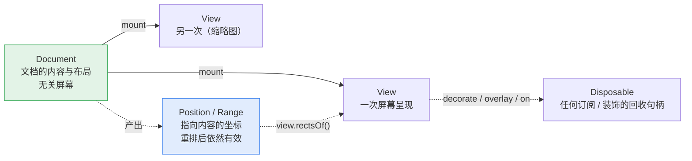

# API 设计

> 配套文档：[架构设计](./architecture.md)（内部怎么切）· [开发计划](DEVELOPMENT-PLAN.md)（什么顺序做）
>
> 本文是**设计**文档，不是使用手册——除标 🟢 外，下述 API 尚未实现。
> 标注含义：🟢 已可用 · 🟡 签名已定，待实现 · ⚪ 形状待定

**这个库的卖点不只是「能把 docx 画出来」，而是「画出来之后你能对它做事」**——
定位到某段、在它旁边挂个 React 批注、填模板、导回 docx。
所以 API 设计的重心在**查询、定位、装饰、锚定**这四件事上，而不是加载参数有多少个。

---

## 1. 快速开始 🟢

```ts
import { UltimateWord } from 'ultimate-word';

const doc = await UltimateWord.load(arrayBuffer);
const view = doc.mount('#container');
```

两行。其余一切都是可选的。

> 🟢 2026-09-13 起这两行是真的（`packages/ultimate-word`）。`apps/playground` 的调试台
> 就只靠它们跑，`apps/playground/tests/facade.html` 是它的浏览器回归（15 项）。
> 类型名带 `Uw` 前缀：`UwDocument` / `UwView` —— 裸的 `Document` / `View` 与 DOM 的
> 全局类型撞名，在满是 `HTMLElement` 的调用方文件里十有八九会被当成 DOM 那个。

---

## 2. 心智模型

只有四个概念，理解了这四个就能用全部 API。



**① `Document`——内容 + 布局，不关心屏幕。**
加载一次、排版一次。`doc.pageCount` 是文档的固有属性，不是某个视图的属性。

**② `View`——一次屏幕呈现。一个 Document 可以挂多个 View。**
主视图 + 缩略图侧栏共享同一份布局结果，因为缩放只是坐标变换，
不改变布局（[为什么](./architecture.md#41-一个重要推论缩放永不触发重排)）。
所以「缩略图」不需要第二次排版，几乎零成本。

**③ `DocPosition` / `DocRange`——指向内容的坐标，不是数字偏移。**
它在重排、编辑之后**依然有效**。这是它比 `{ start: 1234 }` 这种全局偏移值钱的地方：
你在第 3 段挂了个批注，用户在第 1 段插入一屏文字，批注还在第 3 段。

**④ `Disposable`——凡是「挂上去」的东西都能摘下来。**
装饰、overlay、事件订阅，一律返回 `{ dispose(): void }`。不提供 `removeXxx(id)` 这类对称 API，
因为句柄式回收在 React `useEffect` 里是一行 `return () => d.dispose()`，
而 id 式回收总有人忘记存 id。

---

## 3. 加载 🟢

```ts
UltimateWord.load(source: LoadSource, options?: LoadOptions): Promise<UwDocument>;

type LoadSource = ArrayBuffer | Uint8Array | Blob | Response | string; // string = URL；File 是 Blob 的子类

interface LoadOptions {
  /** 按文档覆盖字体注册表，默认用全局那份（`UltimateWord.fonts.registry`） */
  fonts?: FontRegistry;
  /** 只作用于取字节那一步（fetch / Blob 读取）；排版是同步的，中途停不下来 */
  signal?: AbortSignal;
}
```

> **当前实现**（2026-09-13）：`mode: 'preview' | 'edit'` 已可用，默认预览。
> 编辑态接入文字 / 段落事务、模型选区与 IME。只有 DOM 渲染器，因此仍没有 `renderer`。
> `virtualize` / `classPrefix` / `fontFamily` / `debug` 从底层原样透出。
> **fit 的分母是最宽 / 最高的那一页**（混合纸张的文档不会有哪一页出界），分子是容器的
> **内容盒**（去掉 padding 与滚动条）再减一个页间距；容器还没排出尺寸时退回 1，等观察器补。
> 视图**没有公开 `update()`**：文档事务自动更新所有视图；改构造选项仍是 `dispose()` 再 `mount()`。

> **为什么 `textLayer` 在预览态默认开、编辑态默认关**：预览态用户期待 Ctrl+F 能搜到字；
> 编辑态有自己的选区系统，再叠一层原生可选文本会导致双重选区打架。

---

## 6. 位置与范围 🟢

```ts
interface DocPosition {
  readonly nodeId: NodeId;       // run 的稳定标识，不是数组下标
  readonly contentIndex: number; // run 里第几个内容片段（w:t / w:tab / w:drawing…）
  readonly offset: number;       // 该片段内的 UTF-16 偏移
}

/** 半开区间 [start, end)。纯数据，没有方法 —— 见下面的说明 */
interface DocRange {
  readonly start: DocPosition;
  readonly end: DocPosition;
  /** 屏幕矩形要问 View 要，因为那是屏幕空间的事 */
}

doc.compare(a: DocPosition, b: DocPosition): -1 | 0 | 1;   // 🟢 不属于这份文档的位置抛错
doc.rangeOf(node: NodeId | DocNode): DocRange | undefined; // 🟢 空段落 / 不存在的 id 答 undefined
```

> ⚠️ **`DocRange` 是纯数据，原先写的 `text()` / `contains()` 两个方法没有了**（2026-09-12）：
> range 是批注、书签、查找结果的存储形态，要能 `JSON.stringify`、要能过 Worker 边界
> （架构原则 1.1），带方法就都不行了。`contains` 变成了函数
> `rangeContains(order, range, other)`；纯文本提取由 `textOfRange(resolvedBody, range, fieldValues?)` 提供（2026-09-23），不往 range 上挂方法。
>
> `compare` / `rangeOf` 现在的低层入口在 `@uw/model` 的 `order.ts`：
> `buildRunOrder(body)` 一次建好 run 的文档序（消费侧现建，与 `LayoutIndex` 同理），
> 再用 `compareDocPositions(order, a, b)` / `rangeContains(order, range, x)` / `rangeOfNode(node)`。
> 它与 `LayoutIndex.compare()` 的差别：**树里有的 run 都算**，空 run、隐藏 run 也能比 ——
> 布局那一份只认排出来的。空段落现以段落 id + `{ contentIndex: 0, offset: 0 }`
> 表示唯一插入点，`rangeOfNode` 返回该点的折叠范围。空单元格的范围也包含其空段落。

> ⚠️ **`contentIndex` 是 2026-08-30 补上的第三个字段**（实现 `LayoutIndex` 时才看清）：
> 一个 run 的内容是一列片段，片段**没有自己的 id**，而「run 内的全局字符偏移」要把前面
> 每个片段的长度加起来才算得出 —— 那是模型才有的数据。命中测试却在**布局**那一侧，
> Worker 化之后它手上只有 `DocumentLayout`，所以位置必须自带片段下标。
> 类型定义在 `@uw/model` 的 `position.ts`，两个方向的转换在 `@uw/layout` 的 `LayoutIndex`。

> **为什么不用「全局字符偏移」这种更省事的表示**：
> 全局偏移在任何编辑之后都会整体平移，你存下来的每个批注位置都会错位。
> `nodeId + offset` 只在**该节点自身**被编辑时才需要调整，
> 而这个调整由事务系统自动完成（见 §10）。

---

## 7. 查询与定位 🟢

四个方法覆盖「我想找到文档里的某个东西」的全部场景：

```ts
// ① 按结构找：类 CSS 选择器
doc.query('paragraph[styleId=Heading1]'): DocNode[];
doc.query('table > row:first-child cell'): DocNode[];
doc.query('sdt[tag=applicant]'): DocNode[];

// ② 按文本找
doc.find('签发人'): DocRange[];
doc.find(/第\s*\d+\s*条/g, { limit: 50 }): DocRange[];

// ③ 屏幕坐标 → 内容位置（命中测试）
view.locate({ clientX: 320, clientY: 540 }): DocPosition | null;

// ④ 内容位置 → 屏幕矩形（一个 range 跨行会有多个矩形）
view.rectsOf(range): ClientRect[]; // { x, y, width, height }，CSS px
```

> ③ 与 ④ 已由 `@uw/view` 接通（2026-09-12）：布局空间的 `LayoutIndex` 负责模型位置
> ↔ twips，`ViewTransform` 负责 twips ↔ CSS px。返回值采用纯数据 `ClientRect`，
> 替代原方案的 `DOMRect`，让不依赖 DOM 的主入口也能提供相同接口。
> `query` / `find` 已实现（2026-09-12），低层入口在 `@uw/model`：
> `queryNodes(body, selector)` 与 `findText(resolvedBody, pattern, options)`；
> `doc.find` / `doc.query` 的门面 2026-09-13 包上了 —— `doc.find` **自动带上**这份文档
> 求值过的域（`fieldValues`），调用方不必知道有这回事。四处要点：
> - **`findText` 吃级联完的树**（`LoadedDocument.resolved`），不是可编辑的那棵：
>   「隐藏不隐藏」要级联完才知道（`w:vanish` 常写在字符样式里）。两棵树的节点 id 一样，
>   结果照样指回可编辑的那棵
> - **匹配跨 run、不跨段落**：Word 会把一个词切成好几个 run，「签发人」分在三个 run 里是常态；
>   段落是 Word 查找的天然边界。隐藏 run、域的界桩与指令、软连字符不进匹配串；
>   制表位 / 换行各算一个字符（`\t` / `\n`）；对象算一个 U+FFFC，**阻断**匹配。
>   传 `fieldValues`（`layoutDocumentWithFields()` 的 `values`）可以把求值过的域整个跳过 ——
>   它们显示的是算出来的页码，文件里存的旧值搜到了也画不到屏幕上
> - 字符串默认**不分大小写**（Word 的默认），`matchCase: true` 才分；正则跟自己的 flags 走，
>   `g` / `y` 由实现接管（调用方正则的 `lastIndex` 不会被动）。零长匹配跳过
> - 选择器**只有** `paragraph` / `run` / `table` / `row` / `cell` 五种类型；下表列的
>   `image` / `field` / `sdt` 会抛错而不是答空 —— 图片是 run 内容的片段不是节点，域不在树上，
>   内容控件解析时已剥成透明容器（`tag` / `alias` 根本没留下）。
>   `:nth-child` 数的是父列表里的位置、**不分类型**（与 CSS 一致）
>
> 以下是已实现的低层只读入口：

```ts
import { mountView } from '@uw/view/dom';

const view = mountView(container, documentLayout, {
  zoom: 1,
  textLayer: true, // 默认：全文原生查找与选区
  virtualize: true, // 默认：仅绘制可见页与相邻页
  overscan: 2, // 可见页前后各预绘制两页
  pageGap: 24, // CSS px
});
const position = view.locate({ clientX: 320, clientY: 540 }); // DocPosition | null
const rectangles = view.rectsOf(range); // ClientRect[]，跨行 / 跨页分别返回
const caret = view.caretRect(range.start); // ClientRect | null
view.scrollTo(range, { align: 'center' }); // 滚到 range 的首行；目标排不出来时返回 false
view.scrollTo({ page: 2 }); // 物理页序（0 起），不是显示页码
view.setZoom(1.5); // 保留 SVG 内容节点与布局索引，不重新排版
view.update(nextLayout); // 重建索引与文字层，清除原生选区；沿用未被覆盖的选项
view.destroy(); // 可重复调用；销毁后查询返回空结果，更新操作抛错
```

页面矩阵按查询实时读取，涵盖滚动、缩放和 CSS 二维变换；不支持透视变换。
`locate` 在纸外、页间空隙、视口外或遮挡处返回 `null`。每页保留占位壳与坐标 SVG，
因此 `rectsOf` / `caretRect` 可返回尚未绘制页面的位置；矩形**不裁剪到当前视口**，
旋转时返回轴对齐包围盒。矩形是瞬时结果，宿主应在滚动、缩放或重排后重新查询；
要自动跟随就用 §8 的 `overlay`（或 `@uw/react` 的 `overlays`，§14）。页面默认纵向居中排列，间距由 `pageGap` 设置，
滚动容器与页面壳的外观由宿主控制，`apps/playground` 提供接入示例。

`textLayer` 默认开启。透明文字层全文常驻，支持浏览器查找（包括离屏与同一行跨样式文字）、
原生选区和辅助技术读取。绘制层设为 `inert` 以免重复匹配；编号与重复表头跳过，
计算域保留，图片保留辅助说明。纯文本复制在视觉行 / 单元格 / 页之间插入换行，
不还原语义段落、表格制表符或富文本；选区跨出本视图时不接管复制。
关闭 `textLayer` 会同时关闭这些原生文字能力，坐标查询仍可用。

`virtualize` 使用 `IntersectionObserver`，同时遵守窗口和祖先滚动容器的裁剪；
无此 API 时全量绘制。滚动与缩放保留文字节点和原生选区，`update()` 会重建它们。
打印见 §13：默认 Ctrl+P 就按文档分页印，`printMode: 'inline'` 才是原地补画。
`zoom` 必须为正有限数，`overscan` 为非负整数，`pageGap` 为非负有限数；
`destroy()` 清理观察器、事件监听与 DOM。

支持的选择器（够用即止，不做完整 CSS）：

| 形式 | 含义 |
|---|---|
| `paragraph` `run` `table` `row` `cell` `image` `sdt` `field` | 按节点类型 |
| `[styleId=X]` `[tag=X]` `[alias=X]` | 按属性 |
| `A B` / `A > B` | 后代 / 直接子 |
| `:first-child` `:last-child` `:nth-child(n)` | 位置伪类 |

> **为什么 `locate` 和 `rectsOf` 在 `view` 上而不在 `doc` 上**：
> 它们涉及屏幕坐标，而屏幕坐标是**每个视图各不相同**的（缩放、滚动位置都不同）。
> 放 doc 上就必须回答「哪个视图的坐标」，那就是设计错误。
> 这正是[三个坐标空间](./architecture.md#4-三个坐标空间)那条约束在 API 表面的体现。

---

## 8. 装饰与锚定 🟢（`UwView` 上原样透出）

**这是本库相对 docx-preview 之类最主要的增量能力。**

```ts
// 高亮 / 下划线 / 任意样式，不改文档内容
const d = view.decorate(range, {
  className: 'search-hit',
  style: { background: '#ffd33d55' },
  layer: 'above-text',                 // 现只支持 'above-text'，见下
});
d.dispose();

// 把任意 DOM / React 组件锚到文档位置上，重排后自动跟随
const o = view.overlay(range.start, bubbleElement, {
  placement: 'right-of-line',          // 'right-of-line' | 'above' | 'below' | 'inline'
  offset: { x: 8, y: 0 },              // 页面壳内 CSS px，不随文档 zoom 放大
});
o.update(newPosition?);                // 换锚点；尺寸自己变了不用调（ResizeObserver 接住）
o.dispose();
```

```ts
view.scrollTo(target: DocPosition | DocRange | { page: number }, options?: {
  align?: 'start' | 'center' | 'end';
  behavior?: 'auto' | 'smooth';
}): boolean;
```

> **已实现的与原方案的差别**（2026-09-12，`@uw/view/dom`）：
> - `decorate` 只支持 `layer: 'above-text'`（透明背景盖在文字上）；`below-text` 要把装饰
>   插进页面 SVG 的绘制层，而绘制层会被虚拟化卸载 —— 装饰住在页壳上正是为了不跟着卸载
> - `overlay` 没有 `follow` 开关：**一律跟随**。滚动与 CSS 变换由浏览器继承（装饰与批注是
>   页壳的子元素），只有缩放 / 重排 / 壳尺寸变化才重算壳内坐标；批注自身尺寸变了由
>   `ResizeObserver` 接住，`update()` 留给「锚点换了」这一种情况
> - `scrollTo` 返回 `boolean`：目标排不出来（空 run、隐藏 run、越界页号）时**不动**并答 false，
>   而不是退到页首 —— 滚到了别处比没滚更难察觉。range 滚到的是**首行**，不是包围盒中心
>   （跨三页的选区滚到中心会落在空白页上）。实现走 `scrollIntoView`，窗口与任意祖先滚动容器
>   都照顾到，宿主不必告诉视图谁在滚

> **为什么装饰不是「往模型里插标签」**：装饰是**视图层**的东西。
> 插进模型会污染文档内容、进 undo 栈、被导出到 docx 里去。
> 分开之后，「同一份文档，A 用户看到自己的批注，B 用户看到自己的」是天然成立的。

---

## 9. 数据绑定（模板填充）🟡

模板填充是这类库最高频的实际用途，值得有一等公民的 API。

```ts
doc.bindings.list(): BindingInfo[];              // 文档里有哪些坑位
doc.bindings.set('applicant', '张三');
doc.bindings.setMany({ applicant: '张三', date: '2026-08-13' });
doc.bindings.apply();                            // 一次性提交 → 触发一次增量重排
```

底层走 OOXML 原生的**内容控件 `w:sdt`**，所以：填完导回 docx，在 Word 里打开
坑位仍然是坑位，可以继续用 Word 编辑——而不是变成一段死文本。

> **为什么 `set` 之后要显式 `apply`**：填 20 个字段就是 20 次重排。
> 显式提交把它变成 1 次。这个取舍在模板场景里差别很明显。

---

## 10. 编辑与事务 🟡

> 门面 `doc.tx()` / `undo()` / `redo()` 已接入文字、段落与字符格式命令，并自动级联 / 排版（复用段落缓存，见 §10.3）。
> 下方 `insertParagraph` 仍是设计目标（公开事件 2026-09-23 已接入，见 §11）；`setParagraphProps` 的参数形状以 §10.1 为准
> （原设想把 `firstLineChars` 平铺在顶层，实现按 `ParaProps` 分组：`{ indent: { firstLineChars: 200 } }`）。

**唯一的模型修改入口是 `doc.tx()`。** 没有零散的 setter。

```ts
doc.tx(t => {
  t.insertText(pos, '正文内容');
  t.deleteRange(range);
  t.setParagraphProps(range, { indent: { firstLineChars: 200 }, justification: 'both' });
  t.setRunProps(range, { bold: true });
  t.insertParagraph(pos, { styleId: 'Heading2' });
});

doc.undo();
doc.redo();
doc.canUndo;  // boolean
```

一个 `tx` = 一个 undo 单元 = 一次重排 = 一次 `document:change` 事件。四件事对齐，
不需要记「哪个操作会不会触发重排」。

连续输入会**自动合并**成一个 undo 单元（时间窗 + 位置连续性判定），
所以打一整段中文按一次 Ctrl+Z 是整段撤销，而不是撤销一个字。

> **为什么强制事务而不是提供 `doc.insertText()` 便捷方法**：
> 便捷方法一旦存在，就会有人连着调 50 次，得到 50 次重排和 50 个 undo 单元。
> 把事务作为唯一入口，性能与撤销语义就是**结构性正确**的，不依赖调用方自觉。

### 10.1 模型层文字事务 🟢

```ts
import { createTextEditor, mapTextPosition, resolveBody } from '@uw/model';

// loaded 是 @uw/model 的 loadDocument() 返回值，pos 指向其中一个 text 片段。
const editor = createTextEditor(loaded.body);
let caret = pos;
const changes = editor.tx(t => {
  t.insertText(caret, '正文内容');
}, { origin: 'input' });
if (changes) caret = mapTextPosition(caret, changes);
const resolved = resolveBody(loaded.cascade, editor.body);
// resolved 可交给布局；此低层入口不会更新 loaded.resolved 或已挂载的视图。

editor.undo(); // 返回反向 TextChangeSet，无历史时为 undefined
editor.redo();
editor.breakHistory(); // 光标移动、焦点切换等输入边界中断合并
```

`createTextEditor(body, { historyLimit?, mergeDelay?, now?, validate? })` 克隆并冻结直接格式树，
`editor.body` 是当前快照；不要直接修改。文字修改保留未修改的 run；结构命令重建块容器路径。`validate` 在提交 / 历史跳转前接收冻结候选树，抛错时保留模型和历史。
`tx` 接受同步回调（返回 `undefined`），返回本次的 `TextChangeSet` 或 `undefined`（无修改）。
回调抛错或任一命令失败，整次事务回滚；捕获命令错误也不能提交前半次修改。
回调结束后句柄失效，不允许重入事务或在回调中操作历史。

- `t.insertText(position, text)` 返回插入后的光标位置；文字不能含换行、制表位或孤立代理项。
  位置落在制表位 / 换行上时写进紧挨着的文字片段，没有就补一个空文字片段。
- `t.insertInline(position, 'tab' | 'lineBreak' | 'pageBreak')`（2026-09-23）插入 `w:tab` / `w:br`（软换行，不结束段落）/
  `w:br w:type="page"`（只插分页符本身，不拆段；单元格里抛错 —— Word 会从那一行拆表，拆表还没有），
  返回它后面的位置；文字中间切成「前半 / 片段 / 后半」，片段边界上不造空文字，后面的片段下标随之后移（位置由变更集映射）。
- `t.deleteRange(range)` 返回删除起点，支持跨 run / 文字片段，以及同一块容器内连续段落；合段保留前段格式和剩余 run 的样式 / 链接。
  只接受正向范围；位置按 UTF-16 计数，但不能切开合法代理对。
- 空段落锚点可输入，首次输入建立带段落标记直接格式的 run；撤销恢复无 run 的原树。
- `t.splitParagraph(position)` 返回新段开头，继承段落和字符格式，后段使用新 id。
- `t.joinParagraph(paragraphId)` 合并同一节 / 单元格中紧邻的两段，返回接缝位置。
- `t.setRunProps(range, patch)` 修改直接字符格式，返回拆分后的同一段文字范围。`patch` 的值写入，
  `null` 删除该项直接格式、回到样式值（`{ bold: false }` 是显式不加粗，二者不同）。
  范围可跨段落、表格与分节，也可覆盖域结果；端点在 run 中间时拆出新 run（前段保留原 id），
  不合并相邻同格式 run。越过段尾或落在空段落时同步修改段落标记格式；非空段落内的折叠范围不修改。
  值与现状相同时不拆 run，整次事务无修改则返回 undefined、不产生撤销单元。
- 跨表格、单元格、分节删除或合段，以及修改域、删除图片等对象会抛错。制表位、换行、符号、不断行 / 软连字符
  **可以删**（2026-09-23 起；原来一律拒绝），删掉的片段换成空文字占住槽位，与文字删空一样不挪后面的下标。
  结构命令可原样搬运未被切开的对象。
- `t.setParagraphProps(range, patch)` 修改范围触及的每个段落（含其间的单元格段落，折叠范围即所在段）
  的直接段落格式，不拆 run、不移动位置，返回原范围。`indent` / `spacing` / `numbering` 按字段合并，字段 `null`
  删单项、整组 `null` 删整组，合并后为空的组不保留；其余键与 `setRunProps` 相同。
  字符单位优先：改 `firstLine` 等 twips 值时须把对应 `*Chars` 置 `null`，否则不生效。
  段落标记格式（`markRunProps`）只能走 `setRunProps`，写在这里抛错。
  `{ numbering: { level } }` 只改层级、沿用样式或直接格式里的 numId；`{ numbering: { numId: 0 } }` 取消编号。
- `t.addList(kind)` 新增一份九级列表定义（`'bullet'` 项目符号 ● ○ ■ / `'decimal'` 编号 `1.` `a)` `i.` 三级一轮，
  每级左缩进 420 twips × 级数、悬挂 420），返回 numId，再用 `setParagraphProps(range, { numbering: { numId, level: 0 } })`
  引用。定义存在 `editor.body.numbering` 上，随事务提交与撤销；本次没有段落改动时整次无修改、定义不留下。
  接着已有列表数请直接引用它的 numId，每次 `addList` 都是一个新的计数。
- `t.insertRow(position, 'above' | 'below')`（2026-09-23）在位置所在的行（最内层表格）上 / 下方插一行：照这一行抄格数、
  `gridSpan`、格属性、行属性（含表头标记）与模板格首段的段落格式，每格一个空段落，返回新行首格（跳过纵向合并的续格）。
  纵向合并按网格列对齐：插在合并区中间的新格是 `continue`，区外是 `none`。不在表格里抛错。
- `t.deleteRows(range)` 删掉两端所在行及其间的行（两端须在同一张最内层表里），删掉合并区首格那一行时下面的续格升成 `restart`；
  删光就删整张表，容器空了补空段落。返回下一行首格（没有就上一行、整表删掉就表后 / 表前的块）；被删行里的位置经变更集
  **收拢**到这里（`PositionMove.collapse`）。行里有域抛错。
- `t.insertColumn(position, 'left' | 'right')`（2026-09-23）在位置所在格的左 / 右边插一列（按**网格列**，不按格下标）：
  新列宽照这一列、**整表变宽**（`w:tblGrid` 插一个数，`dxa` 型的 `w:tblW` 跟着加；`pct` / `auto` 不动）。每一行各自看这条网格边界：
  有格跨过它就 `gridSpan` + 1，落在 `w:gridBefore` / `w:gridAfter` 里就加跳过的列数，否则插一个新格 ——
  照目标那一侧的邻格抄格属性、`vMerge` 与首段段落格式。返回位置所在那一行的新格；那一行的新列被跨列格吃掉时返回原位置。
  表格没写 `w:tblGrid` 时抛错（说不出一列多宽）。
- `t.deleteColumns(range)` 删掉两端所在格覆盖的网格列（取并集，两端须在同一张最内层表里）：整格落在里面的删掉、跨列格缩窄
  （`dxa` 的 `w:tcW` 与 `w:tblW` 跟着减），删到一格不剩的行删掉，失去首格的续格升成 `restart`，删光就删整张表。
  返回原来那一行里接替被删列的格（删的是最右几列就是左边最后一格）；被删格里的位置同样收拢到这里。格里有域抛错。
  合并 / 拆分单元格、拆表还没有。
- 默认最多 100 个撤销单元。只有显式 `origin: 'input'` 的单次纯插入、位置紧接上次末端、
  间隔不超过 1000ms 才合并；默认命令、超时、`breakHistory()`、undo/redo 都打断合并。
  `historyLimit: 0` 关闭历史，`mergeDelay: 0` 关闭合并。每次提交的变更集仍只含本次修改。

`TextChangeSet` 是可结构化克隆的数据：`paragraphIds` 标出受影响段落，`changes` 按执行顺序
记录 `{ paragraphId, nodeId, contentIndex, offset, deletedText, insertedText }`，每项位置相对
上一项应用后的树。结构记录带 `moves` / `inverseMoves`（片段区间迁移）及 `affectedParagraphIds`，其文字字段为空，不应按普通插入处理。undo 返回逆序的反向修改，redo 返回正向修改。
`mapTextPosition(pos, changes, 'before' | 'after')` 映射旧位置，默认跟随插入点之后；
删除区内的位置收拢到删除点。`mapTextRange` 默认排除两端新插入的文字，折叠范围保持折叠。
**这些函数返回新位置，不会自动修改已存的批注 / 选区**；删除区内部的原始偏移会丢失，
若撤销时需要恢复原始选区，输入层须另存选区快照。

### 10.2 门面编辑态与 IME 🟢

```ts
const doc = await UltimateWord.load(bytes);
const view = doc.mount('#container', { mode: 'edit' });
const range = doc.rangeOf(doc.query('paragraph')[0]);
if (range) view.select?.({ start: range.start, end: range.start });
view.focus?.();
doc.tx(t => { t.insertText(pos, '正文'); });
doc.undo();
doc.redo();
console.log(doc.canUndo, doc.canRedo, view.selection);
```

光标来自布局索引的字缝；空段落通过附加位置元数据定位，不插入占位字形，不改变行高。
点击 / 拖选、左右按字素移动（含 Shift 扩选）、上下按实际布局行移动（支持跨页）、Enter 拆段、
Backspace / Delete 删除或合段、纯文本多行粘贴和 Ctrl/Cmd+Z 撤销均已接通。
Ctrl / Option + 左右键按词移动，支持 Shift 扩选；右键到下一个分词片段末尾，左键到片段开头，
跳过空白，标点与 emoji 单独停靠。双击选中点击字符所属的词，段尾选择最后一个词。
分词与字素切分使用 `Intl.Segmenter('zh')`，跨 run / 文字片段拼接，不跨对象或段落。
Ctrl / Option + Backspace / Delete 按同样的词边界删除，包含光标到目标边界之间的空白；
已有选区只删除选中内容，段首 / 段尾只合并相邻段落，每次删除形成独立撤销单元。
浏览器 `deleteWordBackward` / `deleteWordForward` 输入事件走同一条事务路径，组合期间忽略。
跨对象、域或不同块容器的删除仍由模型拒绝，保留模型、选区与历史。
反向选区的光标、输入框与滚动跟随移动端；Shift 保留原锚点。
Ctrl/Cmd+A 选中全文正文；Ctrl+Home/End 和 Cmd+↑/↓ 移到正文首尾，支持 Shift 扩选。
范围按模型文档序包含首末空段、表格和各节正文，不包含页眉页脚，不受分页或可见页影响。
这些操作打断连续输入合并并重置上下导航横向记忆；组合期不接管快捷键。
全选后的输入替换与剪切沿用原有删除限制，跨单元格 / 分节或不可编辑片段仍原子拒绝。
上下键跳过页眉页脚、空白补页、重复表头与无源域结果；连续移动保留纸坐标横向位置，
经过短行、缩放和滚动也不重置。其他编辑、点击或显式选区操作会重新起算。
软换行共享字缝沿用索引的「归下一行」约定；向上落点取目标行内可反查的位置，尚无行尾视觉 affinity。
编辑输入框的原生 `copy` / `cut` 事件读取模型选区并写入 `text/plain`，支持 Ctrl/Cmd+C、
Ctrl/Cmd+X 与系统菜单；复制保留选区，剪切折叠到起点，并作为单次事务撤销 / 重做。
段落（包括空段和单元格内段落）以换行分隔，自动折行与分页不额外换行；显式换行和制表位保留。
使用级联后的隐藏属性，跳过隐藏文字、域代码和软连字符；对象复制 U+FFFC 占位，计算域复制当前完整显示值。
折叠选区或没有可复制文字时不覆盖剪贴板；没有剪贴板数据或写入失败时不删除原文。
不可编辑范围仍由删除事务拒绝；预提交检查失败保留原文与选区，但剪贴板可能已经写入所选文本。
组合期间不接管复制 / 剪切。
**富文本剪贴板**（2026-09-23）：复制 / 剪切同时写 `text/html`（`fragmentOfRange()` 的级联结果，
照 Word 的写法出：`font-family` + `mso-ascii/hansi/fareast-font-family` 分桶、pt 字号、开关、颜色、段落对齐），
纯文本与 HTML 出自同一份片段、取舍一致。粘贴优先读 `text/html`（读不出字才退回纯文本），按来源分两种：
我们自己 / Word / WPS 的 HTML **保留源格式**（字体分桶、字号、颜色、对齐，没写的开关按「没有」写），
网页 HTML **只带加粗 / 斜体 / 下划线 / 删除线 / 上下标且只加不减** —— 网页字体与 px 字号进了公文就是一段排版不对的字。
源段落的对齐落在以源段落标记结尾的那几段上，最后一块并进原段落后半截、保留原段落对齐（Word 的段落格式跟着段落标记走）。
块元素拆段、段内 `<br>` 是软换行（`w:br`）、`pre` 里的制表符是 `w:tab`，图片跳过。
低层入口：`@uw/model` 的 `fragmentOfRange`，`@uw/view` 的 `fragmentToHtml` / `htmlToParagraphs` / 控制器 `insertParagraphs`。
Ctrl/Cmd+B / I / U（以及 `formatBold` 等输入事件）切换加粗 / 斜体 / 单下划线：按级联后的格式，
选区全部已有时取消，否则设置；拆 run 后选区与反向 focus 保持不变，一次切换一个撤销单元。
空段落里的折叠光标直接修改段落标记；非空段落里的折叠光标不改模型，格式暂存到下一次输入
（含 IME 提交与多行粘贴），移动、删除、Enter 或重新选择即丢弃。带 Alt / Shift 的组合与组合期不接管。
低层 `runPropsOfRange(resolvedBody, range)` 返回选区覆盖的级联字符格式，可用于工具栏状态。
Ctrl/Cmd+L / E / R / J 设置左 / 居中 / 右 / 两端对齐，作用于选区触及的全部段落；按级联结果判断，
全部已是该对齐时回到左对齐（Word 的行为：样式给的居中标题按 Ctrl+E 同样变成左对齐）。
选区与光标不变，一次一个撤销单元。`paragraphsOfRange(resolvedBody, range)` 返回选区触及的级联段落节点。
列表段落（画出了编号的段落）按 Word 的习惯编辑：段首光标或整段都是列表的选区里，Tab / Shift+Tab
逐段降 / 升一级（0–8）；其余位置 Tab 插入制表位（Word 的行为），Shift+Tab 不接管 —— 留给浏览器把焦点移出编辑区。
Shift+Enter 插入软换行（换行不分段，段落格式与编号不变）。Ctrl+Enter（Mac 上 Cmd+Return）插入分页符并**紧接着拆段** ——
Word 2013 起分页符后面跟一个段落标记，后文从新段落、新一页开始（照 Word 界面行为写的，没有真值样本）；
复制时分页符在 `fragmentOfRange` 里是 U+000C、`text/html` 里按 Word 的写法是 `<br style="page-break-before:always">`、
纯文本里是换行；粘贴认这个 `<br>`，单元格里退成软换行；
控制器入口 `pageBreak()`，一个撤销单元；单元格里不插。Ctrl+Shift+Enter（分栏符）不接管。
空列表项上 Enter 先升一级、到顶层即取消编号，不再拆出新空项；段首 Backspace 先取消编号，再按一次才合段。
Ctrl/Cmd+Shift+L 套用 / 取消项目符号列表（Word 这个键套用「列表项目符号」样式；样式不一定存在，这里直接套定义）；
控制器的 `toggleList('bullet' | 'decimal')` 是同一条路，全是这一种列表时取消，否则紧邻上一段是同类列表就接着它数、
选区里已有同类列表就并进去、都没有才新建定义；已是列表的段落保留层级，一次一个撤销单元。
Ctrl+M / Ctrl+Shift+M 把左缩进推到下一个 / 退到上一个默认制表位（`w:defaultTabStop`）的整数倍，不低于 0；
左缩进写的是字符单位时按两个字挪（未与 Word 逐格对过）；选区全是列表段落时改为逐段升降级。
Ctrl+1 / 2 / 5 设单倍 / 双倍 / 1.5 倍行距（多倍规则，固定值行距一并改掉）。这几个键只认 Ctrl ——
Mac 的 Cmd+M 最小化窗口、Cmd+数字切标签页，Windows 的 Ctrl+数字也被浏览器截走，所以行距快捷键在
Windows 上到不了页面，只能走控制器的 `lineSpacing(multiple)`（`indent(direction)` 同理）。
单元格里的 Tab / Shift+Tab 选中下一格 / 上一格的全部内容（控制器 `moveCell(direction)`，模型侧 `adjacentCellRange()`），
优先于列表升降级；按最内层表格走、跳过纵向合并的续格，末格 Tab 学 Word 在下方加一行、光标进新行首格（事务 `insertRow`，一个撤销单元），首格 Shift+Tab 什么都不做。
Ctrl+T / Ctrl+Shift+T（控制器 `hangingIndent(direction)`）让**首行原地不动**、左缩进推到下一个 / 退到上一个默认制表位的
整数倍，差出来的就是悬挂缩进；退只在已有悬挂时退、不退过首行。字符单位的缩进先按段落的 `charUnit`
（`@uw/layout` 的 `indentCharUnit`，与排版同一条规则：首个看得见的字的字号）换成 twips，结果一律写 twips 并把字符单位清零。
Ctrl+0（`toggleSpaceBefore()`）让段前间距在 0 与 12pt 之间切换，行单位与自动间距一并清掉。
这两组同样只认 Ctrl，而且 Windows 上 Chrome 截走 Ctrl+T（新标签页）与 Ctrl+0（重置缩放），只在 Mac 上到得了页面。
Word 的规则照界面行为写，**没有与 Word 逐格对过**。
`NumberLabel.format` 给出本级的 `w:numFmt`，工具栏可据此显示当前是项目符号还是编号。
段首 Backspace 去编号时与 Word 一样把级联后的左缩进写成直接格式（首行 / 悬挂写显式 0，免得退回样式的首行缩进），
文字留在原处；空项 Enter 结束列表与 `toggleList` 取消时不写，文字回到页边。
再按一次 Backspace 直接合段 —— Word「用 Tab 和 Backspace 设置左缩进」开着时会先减缩进，这里未做。
textarea 常驻挂载容器，提交后更新页树与全部挂载视图，重排不会替换输入节点。
组合输入期间不修改模型，`compositionend` 作为一次独立事务提交；尾随输入事件去重，
取消 / 失焦丢弃未提交组合串。缩放与滚动会刷新输入位置。

当前复用段落布局缓存，级联、分页和视图更新仍完整执行；行内局部重排、编号样式选择、图片 / docx 片段粘贴、屏幕阅读器编辑、
完整选区历史仍待实现；公开事件（`document:change` / `selection:change` 等）见 §11。
浏览器回归 `/tests/editing.html` 使用组合事件验证接线；系统拼音候选窗的实际行为仍需人工验证。

### 10.3 段落布局缓存 🟢

门面每份文档自动持有一份缓存，加载、文字事务、撤销和重做共用；无需配置。
未变化段落跳过分桶、度量、断行与行盒装配，表格内段落和页眉页脚同样适用。
正文级联、表格几何、分页、域求值迭代和视图更新仍完整执行。

低层 `@uw/layout` 调用可复用 `new ParagraphLayoutCache(capacity?)`，通过
`layoutParagraph` / `layoutDocument` / `layoutDocumentWithFields` 的 `paragraphCache` 选项传入。
容量是正整数，默认 2048 项，按 LRU 淘汰；`size` 查看项数，`clear()` 显式释放。
缓存不写入 `DocumentLayout`，输出仍可结构化克隆，并与缓存内部数据隔离。

缓存比较段落内容、节点 id、级联属性、宽度、网格、设置、布局规则及本段域显示值。
更换度量器或其 `revision` 变化时清空缓存；`createTextMeasurer()` 的版本跟随
`FontRegistry.register` / `registerMetrics` / `substitute`，度量器内部缓存同步失效。
自定义 `TextMeasurer` 可提供只读数字 `revision`，在度量来源变化时递增；未提供则跳过段落缓存。
字体注册本身不自动触发已挂载文档重排，下一次有修改的事务或历史跳转使用新度量。


---

## 11. 事件 🟢（2026-09-23）

```ts
doc.on('layout:done', ({ pageCount, duration, iterations }) => {});
doc.on('document:change', ({ changeSet, source }) => {});   // source: 'tx' | 'undo' | 'redo'
doc.on('diagnostic', (d: Diagnostic) => {});

view.on('selection:change', (sel: DocRange | null) => {});
view.on('click:element', ({ kind, node, href, position, originalEvent }) => {});
view.on('viewport:change', ({ visiblePages, zoom }) => {});
```

全部返回 `Disposable`。命名统一为 `名词:动词`，不用 `onXxx` 属性式，
因为属性式天然只能挂一个监听者。

| 事件 | 时机 | 典型用途 |
|---|---|---|
| `layout:done` | 事务 / 撤销 / 重做后的排版完成（含域求值的全部迭代，见架构 §6） | 隐藏 loading、上报耗时 |
| `document:change` | 事务提交后，紧挨在 `layout:done` 之前 | 标记「未保存」、协同同步 |
| `diagnostic` | 编辑后重排新发现的内容问题（去重） | 收集上报 |
| `selection:change` | 编辑态选区按值变化 | 联动工具栏 |
| `click:element` | 点到超链接 | 弹出编辑面板、跳转 |
| `viewport:change` | 看得见的页或倍率变化 | 同步缩略图高亮 |

实现时定下 / 与原设想不同的几处：

- **加载那一趟不派发。** `load()` 返回之前没人来得及挂监听者，那一趟的结果就是 `doc.layout` /
  `doc.pageCount`，诊断就是 `doc.diagnostics` 的初值。原表写的 `diagnostic`「解析 / 布局期」因此只剩
  编辑后重排这一半；新发现的同时追加进 `doc.diagnostics`（按内容去重 —— 字体注册后度量器会重新报一遍缺字体）。
- **顺序**：视图先刷新 → `document:change` → `layout:done` → `diagnostic`，全部同步。监听者里读
  `doc.layout`、`view.rectsOf()` 拿到的已经是新布局。没有修改的事务什么都不派发。
- **监听者抛错不传回触发方**，交给 `reportError`：事务已经提交，一个宿主 bug 不该让视图停在旧布局上，
  也不该挡住后面的监听者。
- `selection:change` **只在编辑态**有：预览态原生文字层的划词对不上 `DocRange`。滚动与缩放不算变化，
  事务映射后的光标位移算。
- `click:element` 现在**只认超链接**（`kind: 'hyperlink'`，`href` 是外部地址或 `#书签名`）：图片的绘制层不接指针事件、
  布局索引里没有对象的矩形，内容控件解析时已经剥掉了 —— 所以 payload 先按 `kind` 分支，将来加种类不破坏调用方。
  视图**不替宿主跳转**；拖选结束的那一下 click（选区没折叠）不算。
- `viewport:change` 的 `visiblePages` 来自虚拟化的 IntersectionObserver，是**真的看得见**的页（不含 overscan），
  异步到达；没有它（或 `virtualize: false`）时只在倍率变化时派发、`visiblePages` 为空。

---

## 12. 诊断与错误 🟢

两类问题两种处理，[架构上就分开](./architecture.md#10-错误与诊断)：

这两个类型是**已经实现的**（`@uw/core` 的 `errors.ts` / `diagnostics.ts`），所以这一节写的是
真实签名，不是设计稿：

```ts
// 结构性错误 → 抛
try {
  await UltimateWord.load(bytes);
} catch (e) {
  if (e instanceof UwError && e.code === UwErrorCode.NOT_A_ZIP) { /* ... */ }
}

// 内容问题 → 不抛，记诊断，文档照常渲染
doc.diagnostics; // Diagnostic[] 🟢

interface Diagnostic {
  severity: 'warn' | 'info';
  /** 稳定的短码，kebab-case，如 'font-missing' */
  code: string;
  message: string;                     // 中文，给人看
  part?: string;                       // 出处：部件名，如 '/word/document.xml'
  path?: string;                       // 部件内的元素路径
}
```

| 码 | 类型 | 含义 |
|---|---|---|
| `NOT_A_ZIP` | 抛 `UwError` | 字节流不是 zip 或 zip 目录损坏 |
| `NOT_AN_OPC_PACKAGE` | 抛 | 是 zip 但缺 `[Content_Types].xml` / 根关系 |
| `NOT_A_WORD_DOCUMENT` | 抛 | 是 OPC 包但找不到 officeDocument 主部件 |
| `PART_NOT_FOUND` | 抛 | 关系指向了包里不存在的部件 |
| `MALFORMED_XML` | 抛 | XML 解析失败 |
| `font-missing` | 诊断 | 字体无文件也无度量包，已退到等宽近似 |
| `style-cycle` | 诊断 | `basedOn` 成环，已断链 |
| `style-missing` | 诊断 | 引用了不存在的 styleId |
| `unknown-element` | 诊断 | 不认识的元素，已跳过（同名只报一次） |
| `missing-body` / `styles-missing` / `theme-missing` | 诊断 | 可选部件缺席，按默认值继续 |
| `numbering-missing-abstract` | 诊断 | `numId` 指向了不存在的 `abstractNumId` |
| `field-unbalanced` / `field-unclosed` | 诊断 | 域界桩配不上对，该域按「不显示」处理 |
| `field-no-result` | 诊断（info） | 域缺 `w:fldChar separate`，Word 里它什么都不显示，因此也不求值 |
| `field-nested-eval` | 诊断 | 两个可求值的域抢同一片结果区（嵌套域），内层已跳过 |
| `field-not-converged` | 诊断 | 域求值 5 趟仍未自洽，已冻结在页数最多的那一趟 |
| `header-footer-missing` | 诊断 | 页眉页脚的引用指不到部件，这一节按没有页眉页脚处理 |
| `revision-deleted` | 诊断（info） | 修订痕迹里被删除的文字，不参与排版 |

**规则**：能画出**任何**有意义的东西，就不要抛。

> ⚠️ `Diagnostic` 目前带的是**部件 + 路径**（`part` / `path`），不是 `NodeId` ——
> 诊断产生在解析期，那时节点树还没建完。「点诊断跳到出问题的段落」要等节点 id
> 能在解析期就发出来，届时补一个可选的 `node` 字段，不改现有两项。

---

## 13. 导出与打印 🟡（打印 🟢 2026-09-13 · `toDocx` 🟢 2026-09-23）

```ts
await doc.toDocx(): Promise<Blob>;     // round-trip 安全：未识别的 XML 原样保留
await view.toPNG(page: number, options?: { scale?: number }): Promise<Blob>;   // 未做
view.print(): void;                    // 走文档自带页面设置，不重排，与屏幕缩放无关
```

> **`toDocx()`（2026-09-23）**：Blob 的 `type` 是 `DOCX_MIME`（门面导出）。没编辑过的文档，导出的每个部件与原文件
> **逐字节相同**；编辑过的只重写 `document.xml`（新建过列表再加 `numbering.xml`，原包没有时连带
> `[Content_Types].xml` 与主文档关系表各登记一条），页眉页脚、样式、设置、图片一个字节不动。
> 正文是以原文为底打补丁：没改的段落原样、改过的段落只重写变了的属性组与 run，书签 / 修订 / 边框 / 高亮 /
> 脚注引用 / `w14:paraId` 等模型不认识的内容保留；拆段出来的新段落沿用原段落的 `w:pPr`（不抄 paraId）。
> `docProps/app.xml` 的字数 / 页数统计不更新（Word 打开时自己重算）。低层入口 `@uw/serialize` 的
> `serializeDocx(pkg, body)`，`body` 必须来自同一个包的 `loadDocument(pkg)`（对应关系靠节点 id）。
> 「Word 打开无修复提示」只能在 Windows / Mac 的 Word 里人工验，调试台有「导出 docx」按钮。

> **已实现的与原方案的差别**：`print()` 走 `window.print()`，印的**不是屏幕上那一份** ——
> 它住在宿主的滚动容器里（`overflow:auto` 打印时只印第一屏）、带着缩放与页间距。
> 视图在 `beforeprint` 里往 `<body>` 直下造一张「打印页」：每页一个 pt 尺寸的盒子、
> 同一份布局在 zoom = 1 下的重画，`@page { size }` 取纸张、边距 0（页边距早已算进版心），
> 打印样式把 body 的其余直接子元素藏起来；`afterprint` 拆掉。**Ctrl+P 默认也走这条路**
> （`printMode: 'document'`），宿主想让 Ctrl+P 印整个页面（文档只是一角）就设 `'inline'`，
> 那时只把没画的页补齐。混合纸张的文档按每页各自的尺寸出（CSS 命名页，Chrome / Firefox 认）。
> 装饰与 overlay **不打**；同一页面几个视图只造一张打印页。实测：22 页样本 `printToPDF`
> 出 22 页、每页正好纸张尺寸，gongwen-01 印出来的基线与 Word 真值差 0.06pt。

---

## 14. React 🟢（2026-09-13，`packages/react`）

```tsx
import { UltimateWordView, useDocument, useDecoration } from '@uw/react';

function Viewer({ url }: { url: string }) {
  const { doc, loading, error } = useDocument(url, { fonts: /* 可选，按文档覆盖注册表 */ });
  const [view, setView] = useState<UwView | null>(null);
  useDecoration(view, hit, { className: 'hit' });       // hit 为 null 时什么都不挂
  if (error) return <ErrorPane error={error} />;
  if (!doc) return <Spinner />;                          // loading 期间 doc 为 null；换 url 时上一份留着

  return (
    <UltimateWordView
      doc={doc}
      zoom="fit-width"
      className="viewer"                                  // 滚动容器就是它：给它 overflow:auto 与高度
      onViewChange={setView}                              // 挂上 / 重挂 / 销毁（null）时叫；想直接拿句柄用 ref
      overlays={comments.map(c => ({
        key: c.id,                                        // 同一列里唯一；换 key = 换气泡，输入状态不保留
        anchor: c.range.start,
        placement: 'right-of-line',
        render: () => <CommentBubble comment={c} />,
      }))}
    />
  );
}
```

`overlays` 走声明式：React 侧只描述「哪些批注、锚在哪」，挂载 / 卸载 / 重排跟随由组件内部
转成命令式的 `view.overlay()` 调用（`overlays.ts` 的 `reconcileOverlays`，纯函数）。
气泡是 portal 进宿主元素的**正常 React 子树** —— context、事件、state 都在，视图只管它摆在哪。

> **已实现的与原方案的差别**：
> - 没有 `onSelectionChange`：选区是 Phase 7 的事，不摆不生效的 prop
> - **构造选项变了就重挂**（`pageGap` / `textLayer` / `virtualize` / `overscan` / `classPrefix` /
>   `fontFamily` / `debug` / `printMode`）—— `UwView` 没有 `update()`（§5）。所以 `fontFamily`
>   要给稳定引用（`useCallback`）；`zoom` 单独走 `setZoom()`，改它不重挂
> - 重挂后 overlay 在新视图上重新挂，**宿主元素与其中的 React 子树不动**，气泡里打了一半的字还在
>   （`/tests/react.html` 里有这条断言）；锚点变了走 `handle.update()`，placement / offset 变了
>   只能摘了重挂（底层句柄只认锚点）
> - `useDocument` 的 `source` 按引用比：字符串 URL 天然稳定，`ArrayBuffer` / `Blob` 要调用方 memo。
>   换来源时上一份文档留着（不闪白），上一趟没回来的用 `AbortSignal` 掐掉（只掐得住取字节那一步）
> - `useDecoration` 的 range 与 options 按**值**比 —— 调用方每次渲染都会造新对象

---

## 15. 配方

### 搜索并高亮全部命中

```ts
let hits: Disposable[] = [];
function search(keyword: string) {
  hits.forEach(d => d.dispose());
  const ranges = doc.find(keyword);
  hits = ranges.map(r => view.decorate(r, { className: 'hit' }));
  if (ranges.length) view.scrollTo(ranges[0], { align: 'center' });
}
```

`apps/playground` 的查找框就是这一段（低层入口版：`findText` + `decorate` + `scrollTo`），
回车 / Shift+回车在命中之间循环。

### 给每个一级标题右侧挂一个批注气泡

```ts
for (const h of doc.query('paragraph[styleId=Heading1]')) {
  const el = renderBubble(h);
  view.overlay(doc.rangeOf(h.id).start, el, { placement: 'right-of-line' });
}
```

### 填模板并导出

```ts
doc.bindings.setMany({ applicant: '张三', dept: '技术部', date: '2026-08-13' });
doc.bindings.apply();
const blob = await doc.toDocx();
```

### 主视图 + 缩略图联动

```ts
const main = doc.mount('#main', { zoom: 'fit-width' });
const thumbs = doc.mount('#thumbs', { zoom: 0.15, textLayer: false });
main.on('viewport:change', ({ visiblePages }) => thumbs.scrollTo({ page: visiblePages[0] }));
```

两个视图共享同一份布局结果，缩略图**不产生额外排版开销**。

---

## 16. 稳定性承诺

| 层级 | 承诺 |
|---|---|
| `ultimate-word` 门面包 | 1.0 之后遵循 semver，破坏性变更走 major |
| `@uw/*` 子包 | 视为内部实现，可能随时调整；直接依赖需自担风险 |
| `LayoutResult` 等中间数据结构 | **不是**公开 API，它是我给自己留的可测试接缝 |

> 之所以要把中间结构明确排除在公开 API 之外：一旦有人依赖 `LayoutResult` 的字段，
> 增量排版和 Worker 化就都动不了了——而那两件事[从第一天就是架构目标](./architecture.md#9-线程模型与未来的-wasm)。

---

## 17. 交付路线

| API | 阶段 |
|---|---|
| `load` · `mount` · 只读渲染 | Phase 2–3 ✅（门面 2026-09-13） |
| `print` | Phase 6 ✅（2026-09-13） |
| `query` · `find` · `locate` · `rectsOf` · `decorate` · `overlay` · `scrollTo` | Phase 6 ✅（门面 2026-09-13） |
| `tx` · `undo` / `redo` · 选区 · IME | Phase 7 |
| `toDocx` | Phase 8 |
| `bindings` | Phase 5–6 |
| `@uw/react` | Phase 6 ✅（2026-09-13） |
