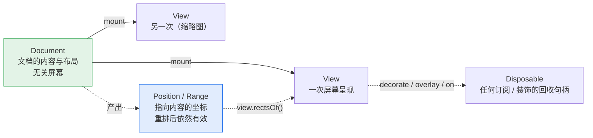

# API 设计

> 配套文档：[架构设计](./architecture.md)（内部怎么切）· [开发计划](DEVELOPMENT-PLAN.md)（什么顺序做）
>
> 本文是**设计**文档，不是使用手册——除标 🟢 外，下述 API 尚未实现。
> 标注含义：🟢 已可用 · 🟡 签名已定，待实现 · ⚪ 形状待定

**这个库的卖点不只是「能把 docx 画出来」，而是「画出来之后你能对它做事」**——
定位到某段、在它旁边挂个 React 批注、填模板、导回 docx。
所以 API 设计的重心在**查询、定位、装饰、锚定**这四件事上，而不是加载参数有多少个。

---

## 1. 快速开始 🟢

```ts
import { UltimateWord } from 'ultimate-word';

const doc = await UltimateWord.load(arrayBuffer);
const view = doc.mount('#container');
```

两行。其余一切都是可选的。

> 🟢 2026-09-13 起这两行是真的（`packages/ultimate-word`）。`apps/playground` 的调试台
> 就只靠它们跑，`apps/playground/tests/facade.html` 是它的浏览器回归（15 项）。
> 类型名带 `Uw` 前缀：`UwDocument` / `UwView` —— 裸的 `Document` / `View` 与 DOM 的
> 全局类型撞名，在满是 `HTMLElement` 的调用方文件里十有八九会被当成 DOM 那个。

---

## 2. 心智模型

只有四个概念，理解了这四个就能用全部 API。



**① `Document`——内容 + 布局，不关心屏幕。**
加载一次、排版一次。`doc.pageCount` 是文档的固有属性，不是某个视图的属性。

**② `View`——一次屏幕呈现。一个 Document 可以挂多个 View。**
主视图 + 缩略图侧栏共享同一份布局结果，因为缩放只是坐标变换，
不改变布局（[为什么](./architecture.md#41-一个重要推论缩放永不触发重排)）。
所以「缩略图」不需要第二次排版，几乎零成本。

**③ `DocPosition` / `DocRange`——指向内容的坐标，不是数字偏移。**
它在重排、编辑之后**依然有效**。这是它比 `{ start: 1234 }` 这种全局偏移值钱的地方：
你在第 3 段挂了个批注，用户在第 1 段插入一屏文字，批注还在第 3 段。

**④ `Disposable`——凡是「挂上去」的东西都能摘下来。**
装饰、overlay、事件订阅，一律返回 `{ dispose(): void }`。不提供 `removeXxx(id)` 这类对称 API，
因为句柄式回收在 React `useEffect` 里是一行 `return () => d.dispose()`，
而 id 式回收总有人忘记存 id。

---

## 3. 加载 🟢

```ts
UltimateWord.load(source: LoadSource, options?: LoadOptions): Promise<UwDocument>;

type LoadSource = ArrayBuffer | Uint8Array | Blob | Response | string; // string = URL；File 是 Blob 的子类

interface LoadOptions {
  /** 按文档覆盖字体注册表，默认用全局那份（`UltimateWord.fonts.registry`） */
  fonts?: FontRegistry;
  /** 只作用于取字节那一步（fetch / Blob 读取）；排版是同步的，中途停不下来 */
  signal?: AbortSignal;
}
```

> **已实现的与原方案的差别**（2026-09-13）：`layoutOnLoad` / `worker` / `pageSetup` 三个字段
> **没有**。前两个是增量排版与 Worker 化（架构 §7 / §9）的开关，那两件事还没做，先摆一个
> 不生效的选项等于骗人；`pageSetup` 要等「按容器宽度重排」有真实需求再定形状。
> `fonts` 从形状待定的 `FontOptions` 收成了一个 `FontRegistry` —— 「按文档覆盖」就是换一份注册表，
> 没有第二种含义。

`load` 是唯一的异步入口（要解压、解析、可能要 fetch 字体）。
**之后所有查询都是同步的**——布局结果已经在内存里，
`doc.find()` 没有理由返回 Promise。这条对调用方的心智负担差别很大。

---

## 4. 字体 🟢

字体是这个库保真度的地基，所以它有一个独立的、全局的注册表。

```ts
UltimateWord.fonts.register(family: string, data: ArrayBuffer | Uint8Array, postscriptName?: string): Promise<void>;
UltimateWord.fonts.registerMetrics(pack: MetricsPack): void;
UltimateWord.fonts.substitute(map: Record<string, string>): void;
UltimateWord.fonts.status(family: string | string[]): 'file' | 'metrics' | 'fallback' | 'missing';
UltimateWord.fonts.registry: FontRegistry; // 底层注册表，按文档覆盖时拿它造一份新的
```

> ⚠️ **`register()` 是异步的**（原来写的 `void`，2026-09-13 改）：解码字体要 fontkit，而门面的
> 主 chunk 刻意不带它 —— `@uw/fonts` 把解码关在 `/decode` 子路径里正是为了让只带度量包的
> 部署不必打包 fontkit，门面若静态 import 那条路就把这个好处整个吃掉了。动态 `import()`
> 让打包器自然拆出一个 chunk，第一次调 `register` 才加载。`.ttc` 字体集要用
> `postscriptName` 指定其中一款（simsun.ttc 里同时有 SimSun 与 NSimSun）。

对应[三级降级策略](./architecture.md#53-度量的三级降级)：

```ts
// ① 有真实字体文件：度量与渲染都准
UltimateWord.fonts.register('FangSong', await fetch('/fonts/simfang.ttf').then(r => r.arrayBuffer()));

// ② 只有度量包：排版与 Word 一致（断行点、页数），字形用替代字体
UltimateWord.fonts.registerMetrics(await fetch('/metrics/fangsong.json').then(r => r.json()));
UltimateWord.fonts.substitute({ '仿宋_GB2312': 'Noto Serif CJK SC' });

// ③ 什么都没有：等宽近似，页数可能对不上
UltimateWord.fonts.status('方正小标宋简体'); // → 'missing'
```

`status()` 的四态里 `fallback` 与 `missing` 别搞反（`FontRegistry.status()` 的实际语义）：
**`fallback` = 替换表命中了另一款已注册的字体**（字形还算像，度量已经偏离 Word，
但注册一份度量包就能修好）；**`missing` = 什么都没命中**，走等宽近似。

> **随库那 17 款不需要调用方操心**：A/B/C/D 四类度量包已经入库
> （`packages/fonts/packs`，88 KB），门面在**模块加载时**就注册进全局注册表
> （走 `@uw/fonts/packs` 的 `bundledPacks()` —— JSON import，浏览器与 Node 同一条路；
> `@uw/fonts/node` 的 `loadBundledPacks()` 靠 `readFileSync`，只剩离线工具在用）。
> 上面的 `registerMetrics` 是给**清单之外**的字体用的（比如 `仿宋_GB2312`）。

> **级别③ 现在是等宽近似，不是 `canvas.measureText`**：canvas 是 DOM API，
> 而 `@uw/fonts` 在无 DOM 区（架构原则 1.2），调不到它。这个洞的三条出路见
> [架构 §5.3](./architecture.md#53-度量的三级降级)，Phase 3 再定归属。
>
> 门面的 `register(family, data)` 由 `@uw/fonts/decode` 的 `fontSourceFromBytes()` 实现，
> `registerMetrics(pack)` 对应 `FontRegistry.registerMetrics()`。分成子路径是为了让
> 只带度量包的部署不必把 fontkit 打进去。

> **为什么是全局注册表而不是每个文档传一遍**：字体解析和度量缓存是纯开销，
> 同一个页面开十份公文没有理由解析十次宋体。`LoadOptions.fonts` 仍可做**每文档覆盖**，
> 但默认继承全局。

---

## 5. 挂载与视图 🟢

```ts
doc.mount(target: string | Element, options?: ViewOptions): UwView; // 先清空容器

interface ViewOptions {
  zoom?: number | 'fit-width' | 'fit-page';   // 默认 1
  pageGap?: number;                            // CSS px，默认 24
  /** 额外渲染一层原生可选文本，让 Ctrl+F / 划词复制 / 屏幕阅读器可用（默认 true） */
  textLayer?: boolean;
  /** 只绘制可见页前后几页（默认 true）；视口外多绘制几页由 overscan 定（默认 2） */
  virtualize?: boolean;
  overscan?: number;
  classPrefix?: string;                        // 默认 'uw'
  fontFamily?: (family: string) => string;     // Word 字体名 → CSS font-family
  debug?: boolean;                             // 画版心框与行盒
  /** Ctrl+P 怎么印：'document'（默认，一页一张纸）| 'inline'（原地印，页面怎么排就怎么印） */
  printMode?: 'document' | 'inline';
}
```

```ts
view.setZoom(1.5);
view.setZoom('fit-width');            // 按最宽的那一页算；容器变宽变窄时自动跟（ResizeObserver）
view.zoom;                            // 当前生效的倍率，fit 模式下是算出来的那个数
view.dispose();                       // 摘掉所有 DOM、解绑所有事件、停掉观察器
```

> **已实现的与原方案的差别**（2026-09-13）：`mode` 与 `renderer` 两个字段**没有** ——
> 现在只有预览态与 DOM 渲染器，摆一个只有一个取值的选项没有意义（Phase 7 / canvas 进来再加，
> 加字段不破坏兼容）。多出来的 `virtualize` / `classPrefix` / `fontFamily` / `debug`
> 是底层 `@uw/view/dom` 本来就认的，门面原样透出。
> **fit 的分母是最宽 / 最高的那一页**（混合纸张的文档不会有哪一页出界），分子是容器的
> **内容盒**（去掉 padding 与滚动条）再减一个页间距；容器还没排出尺寸时退回 1，等观察器补。
> 视图**没有 `update()`**：重排是 Phase 7 的事，现在改构造选项就是 `dispose()` 再 `mount()`。

> **为什么 `textLayer` 在预览态默认开、编辑态默认关**：预览态用户期待 Ctrl+F 能搜到字；
> 编辑态有自己的选区系统，再叠一层原生可选文本会导致双重选区打架。

---

## 6. 位置与范围 🟢

```ts
interface DocPosition {
  readonly nodeId: NodeId;       // run 的稳定标识，不是数组下标
  readonly contentIndex: number; // run 里第几个内容片段（w:t / w:tab / w:drawing…）
  readonly offset: number;       // 该片段内的 UTF-16 偏移
}

/** 半开区间 [start, end)。纯数据，没有方法 —— 见下面的说明 */
interface DocRange {
  readonly start: DocPosition;
  readonly end: DocPosition;
  /** 屏幕矩形要问 View 要，因为那是屏幕空间的事 */
}

doc.compare(a: DocPosition, b: DocPosition): -1 | 0 | 1;   // 🟢 不属于这份文档的位置抛错
doc.rangeOf(node: NodeId | DocNode): DocRange | undefined; // 🟢 空段落 / 不存在的 id 答 undefined
```

> ⚠️ **`DocRange` 是纯数据，原先写的 `text()` / `contains()` 两个方法没有了**（2026-09-12）：
> range 是批注、书签、查找结果的存储形态，要能 `JSON.stringify`、要能过 Worker 边界
> （架构原则 1.1），带方法就都不行了。`contains` 变成了函数
> `rangeContains(order, range, other)`，`text()` 等 Phase 7 的选区模型一起做。
>
> `compare` / `rangeOf` 现在的低层入口在 `@uw/model` 的 `order.ts`：
> `buildRunOrder(body)` 一次建好 run 的文档序（消费侧现建，与 `LayoutIndex` 同理），
> 再用 `compareDocPositions(order, a, b)` / `rangeContains(order, range, x)` / `rangeOfNode(node)`。
> 它与 `LayoutIndex.compare()` 的差别：**树里有的 run 都算**，空 run、隐藏 run 也能比 ——
> 布局那一份只认排出来的。`rangeOfNode` 对一个 run 都没有的节点（空段落）答 `undefined`：
> `DocPosition` 只能指 run，段落标记还不是 run（Phase 7 的光标模型再补）。

> ⚠️ **`contentIndex` 是 2026-08-30 补上的第三个字段**（实现 `LayoutIndex` 时才看清）：
> 一个 run 的内容是一列片段，片段**没有自己的 id**，而「run 内的全局字符偏移」要把前面
> 每个片段的长度加起来才算得出 —— 那是模型才有的数据。命中测试却在**布局**那一侧，
> Worker 化之后它手上只有 `DocumentLayout`，所以位置必须自带片段下标。
> 类型定义在 `@uw/model` 的 `position.ts`，两个方向的转换在 `@uw/layout` 的 `LayoutIndex`。

> **为什么不用「全局字符偏移」这种更省事的表示**：
> 全局偏移在任何编辑之后都会整体平移，你存下来的每个批注位置都会错位。
> `nodeId + offset` 只在**该节点自身**被编辑时才需要调整，
> 而这个调整由事务系统自动完成（见 §10）。

---

## 7. 查询与定位 🟢

四个方法覆盖「我想找到文档里的某个东西」的全部场景：

```ts
// ① 按结构找：类 CSS 选择器
doc.query('paragraph[styleId=Heading1]'): DocNode[];
doc.query('table > row:first-child cell'): DocNode[];
doc.query('sdt[tag=applicant]'): DocNode[];

// ② 按文本找
doc.find('签发人'): DocRange[];
doc.find(/第\s*\d+\s*条/g, { limit: 50 }): DocRange[];

// ③ 屏幕坐标 → 内容位置（命中测试）
view.locate({ clientX: 320, clientY: 540 }): DocPosition | null;

// ④ 内容位置 → 屏幕矩形（一个 range 跨行会有多个矩形）
view.rectsOf(range): ClientRect[]; // { x, y, width, height }，CSS px
```

> ③ 与 ④ 已由 `@uw/view` 接通（2026-09-12）：布局空间的 `LayoutIndex` 负责模型位置
> ↔ twips，`ViewTransform` 负责 twips ↔ CSS px。返回值采用纯数据 `ClientRect`，
> 替代原方案的 `DOMRect`，让不依赖 DOM 的主入口也能提供相同接口。
> `query` / `find` 已实现（2026-09-12），低层入口在 `@uw/model`：
> `queryNodes(body, selector)` 与 `findText(resolvedBody, pattern, options)`；
> `doc.find` / `doc.query` 的门面 2026-09-13 包上了 —— `doc.find` **自动带上**这份文档
> 求值过的域（`fieldValues`），调用方不必知道有这回事。四处要点：
> - **`findText` 吃级联完的树**（`LoadedDocument.resolved`），不是可编辑的那棵：
>   「隐藏不隐藏」要级联完才知道（`w:vanish` 常写在字符样式里）。两棵树的节点 id 一样，
>   结果照样指回可编辑的那棵
> - **匹配跨 run、不跨段落**：Word 会把一个词切成好几个 run，「签发人」分在三个 run 里是常态；
>   段落是 Word 查找的天然边界。隐藏 run、域的界桩与指令、软连字符不进匹配串；
>   制表位 / 换行各算一个字符（`\t` / `\n`）；对象算一个 U+FFFC，**阻断**匹配。
>   传 `fieldValues`（`layoutDocumentWithFields()` 的 `values`）可以把求值过的域整个跳过 ——
>   它们显示的是算出来的页码，文件里存的旧值搜到了也画不到屏幕上
> - 字符串默认**不分大小写**（Word 的默认），`matchCase: true` 才分；正则跟自己的 flags 走，
>   `g` / `y` 由实现接管（调用方正则的 `lastIndex` 不会被动）。零长匹配跳过
> - 选择器**只有** `paragraph` / `run` / `table` / `row` / `cell` 五种类型；下表列的
>   `image` / `field` / `sdt` 会抛错而不是答空 —— 图片是 run 内容的片段不是节点，域不在树上，
>   内容控件解析时已剥成透明容器（`tag` / `alias` 根本没留下）。
>   `:nth-child` 数的是父列表里的位置、**不分类型**（与 CSS 一致）
>
> 以下是已实现的低层只读入口：

```ts
import { mountView } from '@uw/view/dom';

const view = mountView(container, documentLayout, {
  zoom: 1,
  textLayer: true, // 默认：全文原生查找与选区
  virtualize: true, // 默认：仅绘制可见页与相邻页
  overscan: 2, // 可见页前后各预绘制两页
  pageGap: 24, // CSS px
});
const position = view.locate({ clientX: 320, clientY: 540 }); // DocPosition | null
const rectangles = view.rectsOf(range); // ClientRect[]，跨行 / 跨页分别返回
const caret = view.caretRect(range.start); // ClientRect | null
view.scrollTo(range, { align: 'center' }); // 滚到 range 的首行；目标排不出来时返回 false
view.scrollTo({ page: 2 }); // 物理页序（0 起），不是显示页码
view.setZoom(1.5); // 保留 SVG 内容节点与布局索引，不重新排版
view.update(nextLayout); // 重建索引与文字层，清除原生选区；沿用未被覆盖的选项
view.destroy(); // 可重复调用；销毁后查询返回空结果，更新操作抛错
```

页面矩阵按查询实时读取，涵盖滚动、缩放和 CSS 二维变换；不支持透视变换。
`locate` 在纸外、页间空隙、视口外或遮挡处返回 `null`。每页保留占位壳与坐标 SVG，
因此 `rectsOf` / `caretRect` 可返回尚未绘制页面的位置；矩形**不裁剪到当前视口**，
旋转时返回轴对齐包围盒。矩形是瞬时结果，宿主应在滚动、缩放或重排后重新查询；
要自动跟随就用 §8 的 `overlay`（或 `@uw/react` 的 `overlays`，§14）。页面默认纵向居中排列，间距由 `pageGap` 设置，
滚动容器与页面壳的外观由宿主控制，`apps/playground` 提供接入示例。

`textLayer` 默认开启。透明文字层全文常驻，支持浏览器查找（包括离屏与同一行跨样式文字）、
原生选区和辅助技术读取。绘制层设为 `inert` 以免重复匹配；编号与重复表头跳过，
计算域保留，图片保留辅助说明。纯文本复制在视觉行 / 单元格 / 页之间插入换行，
不还原语义段落、表格制表符或富文本；选区跨出本视图时不接管复制。
关闭 `textLayer` 会同时关闭这些原生文字能力，坐标查询仍可用。

`virtualize` 使用 `IntersectionObserver`，同时遵守窗口和祖先滚动容器的裁剪；
无此 API 时全量绘制。滚动与缩放保留文字节点和原生选区，`update()` 会重建它们。
打印见 §13：默认 Ctrl+P 就按文档分页印，`printMode: 'inline'` 才是原地补画。
`zoom` 必须为正有限数，`overscan` 为非负整数，`pageGap` 为非负有限数；
`destroy()` 清理观察器、事件监听与 DOM。

支持的选择器（够用即止，不做完整 CSS）：

| 形式 | 含义 |
|---|---|
| `paragraph` `run` `table` `row` `cell` `image` `sdt` `field` | 按节点类型 |
| `[styleId=X]` `[tag=X]` `[alias=X]` | 按属性 |
| `A B` / `A > B` | 后代 / 直接子 |
| `:first-child` `:last-child` `:nth-child(n)` | 位置伪类 |

> **为什么 `locate` 和 `rectsOf` 在 `view` 上而不在 `doc` 上**：
> 它们涉及屏幕坐标，而屏幕坐标是**每个视图各不相同**的（缩放、滚动位置都不同）。
> 放 doc 上就必须回答「哪个视图的坐标」，那就是设计错误。
> 这正是[三个坐标空间](./architecture.md#4-三个坐标空间)那条约束在 API 表面的体现。

---

## 8. 装饰与锚定 🟢（`UwView` 上原样透出）

**这是本库相对 docx-preview 之类最主要的增量能力。**

```ts
// 高亮 / 下划线 / 任意样式，不改文档内容
const d = view.decorate(range, {
  className: 'search-hit',
  style: { background: '#ffd33d55' },
  layer: 'above-text',                 // 现只支持 'above-text'，见下
});
d.dispose();

// 把任意 DOM / React 组件锚到文档位置上，重排后自动跟随
const o = view.overlay(range.start, bubbleElement, {
  placement: 'right-of-line',          // 'right-of-line' | 'above' | 'below' | 'inline'
  offset: { x: 8, y: 0 },              // 页面壳内 CSS px，不随文档 zoom 放大
});
o.update(newPosition?);                // 换锚点；尺寸自己变了不用调（ResizeObserver 接住）
o.dispose();
```

```ts
view.scrollTo(target: DocPosition | DocRange | { page: number }, options?: {
  align?: 'start' | 'center' | 'end';
  behavior?: 'auto' | 'smooth';
}): boolean;
```

> **已实现的与原方案的差别**（2026-09-12，`@uw/view/dom`）：
> - `decorate` 只支持 `layer: 'above-text'`（透明背景盖在文字上）；`below-text` 要把装饰
>   插进页面 SVG 的绘制层，而绘制层会被虚拟化卸载 —— 装饰住在页壳上正是为了不跟着卸载
> - `overlay` 没有 `follow` 开关：**一律跟随**。滚动与 CSS 变换由浏览器继承（装饰与批注是
>   页壳的子元素），只有缩放 / 重排 / 壳尺寸变化才重算壳内坐标；批注自身尺寸变了由
>   `ResizeObserver` 接住，`update()` 留给「锚点换了」这一种情况
> - `scrollTo` 返回 `boolean`：目标排不出来（空 run、隐藏 run、越界页号）时**不动**并答 false，
>   而不是退到页首 —— 滚到了别处比没滚更难察觉。range 滚到的是**首行**，不是包围盒中心
>   （跨三页的选区滚到中心会落在空白页上）。实现走 `scrollIntoView`，窗口与任意祖先滚动容器
>   都照顾到，宿主不必告诉视图谁在滚

> **为什么装饰不是「往模型里插标签」**：装饰是**视图层**的东西。
> 插进模型会污染文档内容、进 undo 栈、被导出到 docx 里去。
> 分开之后，「同一份文档，A 用户看到自己的批注，B 用户看到自己的」是天然成立的。

---

## 9. 数据绑定（模板填充）🟡

模板填充是这类库最高频的实际用途，值得有一等公民的 API。

```ts
doc.bindings.list(): BindingInfo[];              // 文档里有哪些坑位
doc.bindings.set('applicant', '张三');
doc.bindings.setMany({ applicant: '张三', date: '2026-08-13' });
doc.bindings.apply();                            // 一次性提交 → 触发一次增量重排
```

底层走 OOXML 原生的**内容控件 `w:sdt`**，所以：填完导回 docx，在 Word 里打开
坑位仍然是坑位，可以继续用 Word 编辑——而不是变成一段死文本。

> **为什么 `set` 之后要显式 `apply`**：填 20 个字段就是 20 次重排。
> 显式提交把它变成 1 次。这个取舍在模板场景里差别很明显。

---

## 10. 编辑与事务 🟡

**唯一的模型修改入口是 `doc.tx()`。** 没有零散的 setter。

```ts
doc.tx(t => {
  t.insertText(pos, '正文内容');
  t.deleteRange(range);
  t.setParagraphProps(pos, { firstLineChars: 200, alignment: 'justify' });
  t.setRunProps(range, { bold: true });
  t.insertParagraph(pos, { styleId: 'Heading2' });
});

doc.undo();
doc.redo();
doc.canUndo;  // boolean
```

一个 `tx` = 一个 undo 单元 = 一次重排 = 一次 `document:change` 事件。四件事对齐，
不需要记「哪个操作会不会触发重排」。

连续输入会**自动合并**成一个 undo 单元（时间窗 + 位置连续性判定），
所以打一整段中文按一次 Ctrl+Z 是整段撤销，而不是撤销一个字。

> **为什么强制事务而不是提供 `doc.insertText()` 便捷方法**：
> 便捷方法一旦存在，就会有人连着调 50 次，得到 50 次重排和 50 个 undo 单元。
> 把事务作为唯一入口，性能与撤销语义就是**结构性正确**的，不依赖调用方自觉。

---

## 11. 事件 🟡

```ts
doc.on('layout:done', ({ pageCount, duration, iterations }) => {});
doc.on('document:change', ({ changeSet }) => {});
doc.on('diagnostic', (d: Diagnostic) => {});

view.on('selection:change', (sel: DocRange | null) => {});
view.on('click:element', ({ node, position, originalEvent }) => {});
view.on('viewport:change', ({ visiblePages, zoom }) => {});
```

全部返回 `Disposable`。命名统一为 `名词:动词`，不用 `onXxx` 属性式，
因为属性式天然只能挂一个监听者。

| 事件 | 时机 | 典型用途 |
|---|---|---|
| `layout:done` | 排版完成（含域求值的全部迭代，见架构 §6） | 隐藏 loading、上报耗时 |
| `document:change` | 事务提交后 | 标记「未保存」、协同同步 |
| `diagnostic` | 解析/布局期发现内容问题 | 收集上报 |
| `selection:change` | 选区变化 | 联动工具栏 |
| `click:element` | 点到图片 / 内容控件 / 超链接 | 弹出编辑面板 |
| `viewport:change` | 滚动 / 缩放 | 同步缩略图高亮 |

---

## 12. 诊断与错误 🟢

两类问题两种处理，[架构上就分开](./architecture.md#10-错误与诊断)：

这两个类型是**已经实现的**（`@uw/core` 的 `errors.ts` / `diagnostics.ts`），所以这一节写的是
真实签名，不是设计稿：

```ts
// 结构性错误 → 抛
try {
  await UltimateWord.load(bytes);
} catch (e) {
  if (e instanceof UwError && e.code === UwErrorCode.NOT_A_ZIP) { /* ... */ }
}

// 内容问题 → 不抛，记诊断，文档照常渲染
doc.diagnostics; // Diagnostic[] 🟢

interface Diagnostic {
  severity: 'warn' | 'info';
  /** 稳定的短码，kebab-case，如 'font-missing' */
  code: string;
  message: string;                     // 中文，给人看
  part?: string;                       // 出处：部件名，如 '/word/document.xml'
  path?: string;                       // 部件内的元素路径
}
```

| 码 | 类型 | 含义 |
|---|---|---|
| `NOT_A_ZIP` | 抛 `UwError` | 字节流不是 zip 或 zip 目录损坏 |
| `NOT_AN_OPC_PACKAGE` | 抛 | 是 zip 但缺 `[Content_Types].xml` / 根关系 |
| `NOT_A_WORD_DOCUMENT` | 抛 | 是 OPC 包但找不到 officeDocument 主部件 |
| `PART_NOT_FOUND` | 抛 | 关系指向了包里不存在的部件 |
| `MALFORMED_XML` | 抛 | XML 解析失败 |
| `font-missing` | 诊断 | 字体无文件也无度量包，已退到等宽近似 |
| `style-cycle` | 诊断 | `basedOn` 成环，已断链 |
| `style-missing` | 诊断 | 引用了不存在的 styleId |
| `unknown-element` | 诊断 | 不认识的元素，已跳过（同名只报一次） |
| `missing-body` / `styles-missing` / `theme-missing` | 诊断 | 可选部件缺席，按默认值继续 |
| `numbering-missing-abstract` | 诊断 | `numId` 指向了不存在的 `abstractNumId` |
| `field-unbalanced` / `field-unclosed` | 诊断 | 域界桩配不上对，该域按「不显示」处理 |
| `field-no-result` | 诊断（info） | 域缺 `w:fldChar separate`，Word 里它什么都不显示，因此也不求值 |
| `field-nested-eval` | 诊断 | 两个可求值的域抢同一片结果区（嵌套域），内层已跳过 |
| `field-not-converged` | 诊断 | 域求值 5 趟仍未自洽，已冻结在页数最多的那一趟 |
| `header-footer-missing` | 诊断 | 页眉页脚的引用指不到部件，这一节按没有页眉页脚处理 |
| `revision-deleted` | 诊断（info） | 修订痕迹里被删除的文字，不参与排版 |

**规则**：能画出**任何**有意义的东西，就不要抛。

> ⚠️ `Diagnostic` 目前带的是**部件 + 路径**（`part` / `path`），不是 `NodeId` ——
> 诊断产生在解析期，那时节点树还没建完。「点诊断跳到出问题的段落」要等节点 id
> 能在解析期就发出来，届时补一个可选的 `node` 字段，不改现有两项。

---

## 13. 导出与打印 🟡（打印 🟢 2026-09-13）

```ts
await doc.toDocx(): Promise<Blob>;     // round-trip 安全：未识别的 XML 原样保留（Phase 8）
await view.toPNG(page: number, options?: { scale?: number }): Promise<Blob>;   // 未做
view.print(): void;                    // 走文档自带页面设置，不重排，与屏幕缩放无关
```

> **已实现的与原方案的差别**：`print()` 走 `window.print()`，印的**不是屏幕上那一份** ——
> 它住在宿主的滚动容器里（`overflow:auto` 打印时只印第一屏）、带着缩放与页间距。
> 视图在 `beforeprint` 里往 `<body>` 直下造一张「打印页」：每页一个 pt 尺寸的盒子、
> 同一份布局在 zoom = 1 下的重画，`@page { size }` 取纸张、边距 0（页边距早已算进版心），
> 打印样式把 body 的其余直接子元素藏起来；`afterprint` 拆掉。**Ctrl+P 默认也走这条路**
> （`printMode: 'document'`），宿主想让 Ctrl+P 印整个页面（文档只是一角）就设 `'inline'`，
> 那时只把没画的页补齐。混合纸张的文档按每页各自的尺寸出（CSS 命名页，Chrome / Firefox 认）。
> 装饰与 overlay **不打**；同一页面几个视图只造一张打印页。实测：22 页样本 `printToPDF`
> 出 22 页、每页正好纸张尺寸，gongwen-01 印出来的基线与 Word 真值差 0.06pt。

---

## 14. React 🟢（2026-09-13，`packages/react`）

```tsx
import { UltimateWordView, useDocument, useDecoration } from '@uw/react';

function Viewer({ url }: { url: string }) {
  const { doc, loading, error } = useDocument(url, { fonts: /* 可选，按文档覆盖注册表 */ });
  const [view, setView] = useState<UwView | null>(null);
  useDecoration(view, hit, { className: 'hit' });       // hit 为 null 时什么都不挂
  if (error) return <ErrorPane error={error} />;
  if (!doc) return <Spinner />;                          // loading 期间 doc 为 null；换 url 时上一份留着

  return (
    <UltimateWordView
      doc={doc}
      zoom="fit-width"
      className="viewer"                                  // 滚动容器就是它：给它 overflow:auto 与高度
      onViewChange={setView}                              // 挂上 / 重挂 / 销毁（null）时叫；想直接拿句柄用 ref
      overlays={comments.map(c => ({
        key: c.id,                                        // 同一列里唯一；换 key = 换气泡，输入状态不保留
        anchor: c.range.start,
        placement: 'right-of-line',
        render: () => <CommentBubble comment={c} />,
      }))}
    />
  );
}
```

`overlays` 走声明式：React 侧只描述「哪些批注、锚在哪」，挂载 / 卸载 / 重排跟随由组件内部
转成命令式的 `view.overlay()` 调用（`overlays.ts` 的 `reconcileOverlays`，纯函数）。
气泡是 portal 进宿主元素的**正常 React 子树** —— context、事件、state 都在，视图只管它摆在哪。

> **已实现的与原方案的差别**：
> - 没有 `onSelectionChange`：选区是 Phase 7 的事，不摆不生效的 prop
> - **构造选项变了就重挂**（`pageGap` / `textLayer` / `virtualize` / `overscan` / `classPrefix` /
>   `fontFamily` / `debug` / `printMode`）—— `UwView` 没有 `update()`（§5）。所以 `fontFamily`
>   要给稳定引用（`useCallback`）；`zoom` 单独走 `setZoom()`，改它不重挂
> - 重挂后 overlay 在新视图上重新挂，**宿主元素与其中的 React 子树不动**，气泡里打了一半的字还在
>   （`/tests/react.html` 里有这条断言）；锚点变了走 `handle.update()`，placement / offset 变了
>   只能摘了重挂（底层句柄只认锚点）
> - `useDocument` 的 `source` 按引用比：字符串 URL 天然稳定，`ArrayBuffer` / `Blob` 要调用方 memo。
>   换来源时上一份文档留着（不闪白），上一趟没回来的用 `AbortSignal` 掐掉（只掐得住取字节那一步）
> - `useDecoration` 的 range 与 options 按**值**比 —— 调用方每次渲染都会造新对象

---

## 15. 配方

### 搜索并高亮全部命中

```ts
let hits: Disposable[] = [];
function search(keyword: string) {
  hits.forEach(d => d.dispose());
  const ranges = doc.find(keyword);
  hits = ranges.map(r => view.decorate(r, { className: 'hit' }));
  if (ranges.length) view.scrollTo(ranges[0], { align: 'center' });
}
```

`apps/playground` 的查找框就是这一段（低层入口版：`findText` + `decorate` + `scrollTo`），
回车 / Shift+回车在命中之间循环。

### 给每个一级标题右侧挂一个批注气泡

```ts
for (const h of doc.query('paragraph[styleId=Heading1]')) {
  const el = renderBubble(h);
  view.overlay(doc.rangeOf(h.id).start, el, { placement: 'right-of-line' });
}
```

### 填模板并导出

```ts
doc.bindings.setMany({ applicant: '张三', dept: '技术部', date: '2026-08-13' });
doc.bindings.apply();
const blob = await doc.toDocx();
```

### 主视图 + 缩略图联动

```ts
const main = doc.mount('#main', { zoom: 'fit-width' });
const thumbs = doc.mount('#thumbs', { zoom: 0.15, textLayer: false });
main.on('viewport:change', ({ visiblePages }) => thumbs.scrollTo({ page: visiblePages[0] }));
```

两个视图共享同一份布局结果，缩略图**不产生额外排版开销**。

---

## 16. 稳定性承诺

| 层级 | 承诺 |
|---|---|
| `ultimate-word` 门面包 | 1.0 之后遵循 semver，破坏性变更走 major |
| `@uw/*` 子包 | 视为内部实现，可能随时调整；直接依赖需自担风险 |
| `LayoutResult` 等中间数据结构 | **不是**公开 API，它是我给自己留的可测试接缝 |

> 之所以要把中间结构明确排除在公开 API 之外：一旦有人依赖 `LayoutResult` 的字段，
> 增量排版和 Worker 化就都动不了了——而那两件事[从第一天就是架构目标](./architecture.md#9-线程模型与未来的-wasm)。

---

## 17. 交付路线

| API | 阶段 |
|---|---|
| `load` · `mount` · 只读渲染 | Phase 2–3 ✅（门面 2026-09-13） |
| `print` | Phase 6 ✅（2026-09-13） |
| `query` · `find` · `locate` · `rectsOf` · `decorate` · `overlay` · `scrollTo` | Phase 6 ✅（门面 2026-09-13） |
| `tx` · `undo` / `redo` · 选区 · IME | Phase 7 |
| `toDocx` | Phase 8 |
| `bindings` | Phase 5–6 |
| `@uw/react` | Phase 6 ✅（2026-09-13） |
