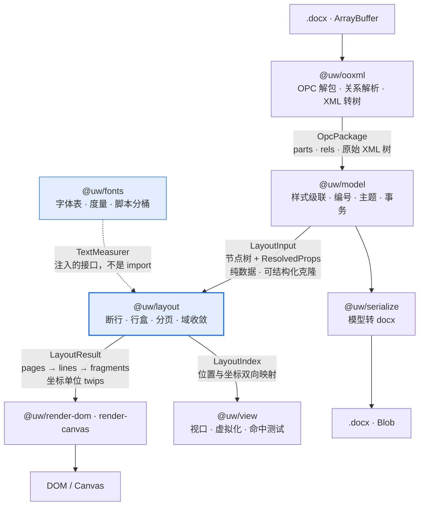
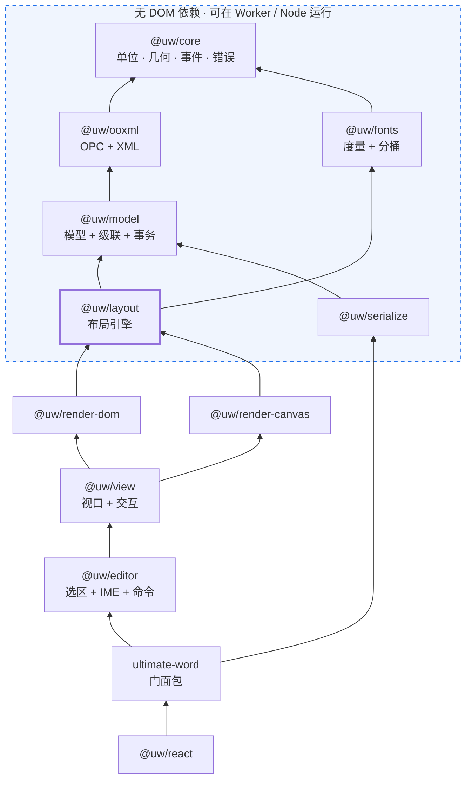
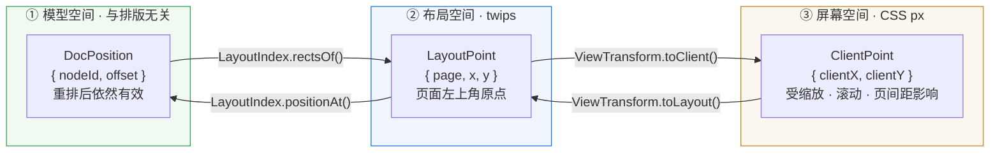
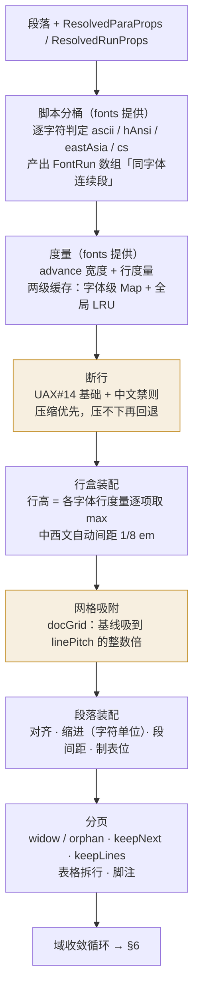
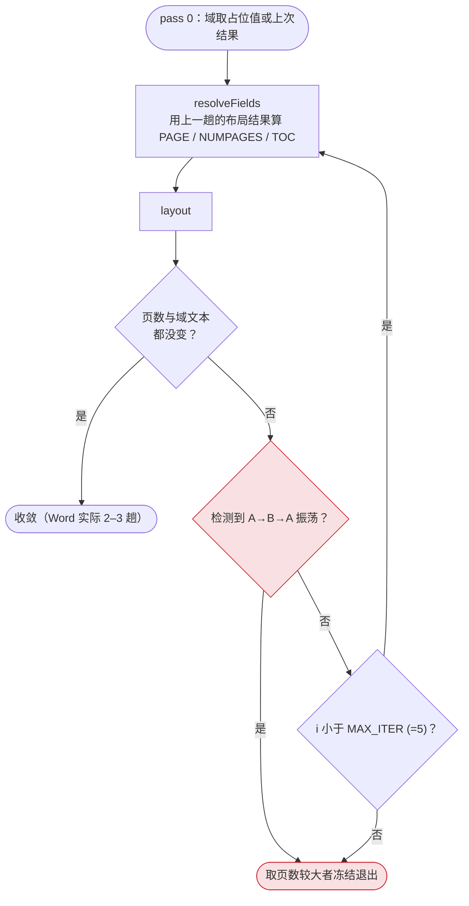
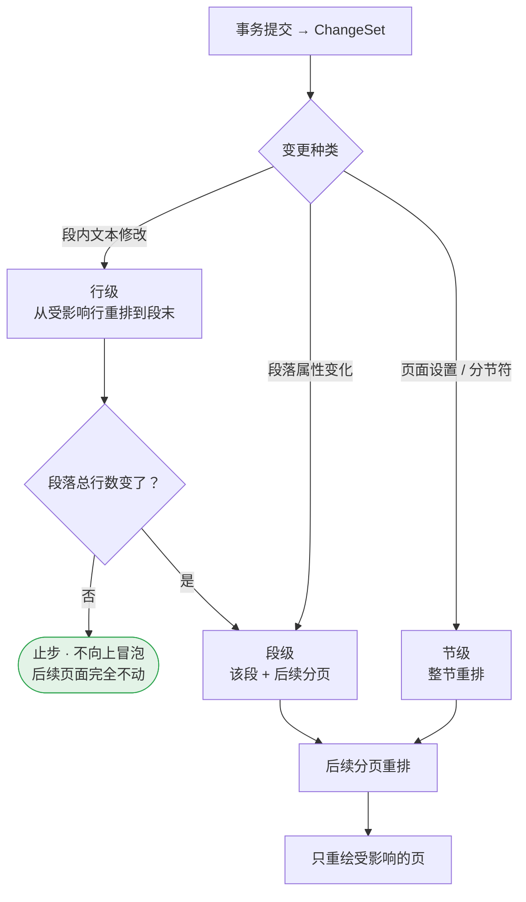
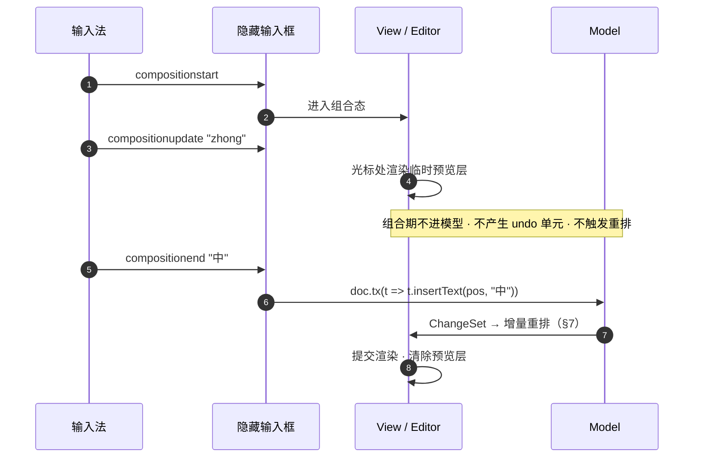

# 架构设计

> 配套文档：[开发计划](DEVELOPMENT-PLAN.md)（做什么、什么顺序）· [API 设计](./api.md)（对外长什么样）
>
> 本文只回答一个问题：**为了让「自己算排版」这件事在工程上站得住，代码该怎么切。**

---

## 0. 一句话概括

**这个库是一个编译器。** 源语言是 OOXML，目标代码是屏幕上的坐标。

这不是比喻，是实际的架构约束。编译器的那套纪律——阶段之间只传不可变的纯数据、
每个阶段可单独测试、后端可替换、中间表示可序列化——正是这个项目能做下去的原因。
反过来，任何「布局的时候顺便读一下 DOM」「渲染的时候回头改一下模型」的捷径，
都会在增量排版或 Worker 化的时候连本带利还回来。

```
.docx 字节  →  OPC 包  →  文档模型  →  布局结果  →  DOM / Canvas
              ────────    ─────────    ─────────
              解析前端     语义中间表示   目标代码
```

---

## 1. 五条设计原则

每条都配了「违反会怎样」——不是格言，是踩过或预见到的具体故障。

### 1.1 阶段之间只传纯数据

阶段的输出必须是**可结构化克隆**的普通对象：没有类实例的方法、没有闭包、
没有对 DOM 节点的引用、没有对上游对象的反向指针。

**为什么**：这一条同时买到三样东西——布局能挪进 Worker、布局能换成 Rust/WASM、
每个阶段的输出能当 golden file 存进仓库做回归。三样都是后期想加就来不及的。

**违反会怎样**：`LayoutResult` 里塞一个指向 `HTMLElement` 的引用，
Worker 化那天要重写整个布局层的数据结构，而那时它已经有一万行了。

### 1.2 布局层不认识 DOM

`@uw/layout` **不得** import 任何 DOM API。它需要测量文本时，用的是注入进来的
`TextMeasurer` 接口，实现由 `@uw/fonts` 提供。

**为什么**：见 1.1。另外这让布局能在 Node 里跑——这是保真度测试能自动化的前提。

**违反会怎样**：布局里出现一次 `document.createElement` 来测宽度，
整个布局层就再也不能在 Worker 和 Node 里跑，保真度回归只能靠人肉看截图。

### 1.3 单位只有 twips，px 只在出口

布局全程 twips（1/1440 英寸），只有渲染器的最后一步转 px。
转换函数集中在 [`@uw/core/units.ts`](../packages/core/src/units.ts)。

**为什么**：OOXML 原生就是 twips / 半磅 / EMU，用它做累加不引入换算误差。
更重要的是——**缩放因此不是布局的输入**，见 §4 的推论。

**违反会怎样**：行高用 px 累加，50 行之后累计漂移 0.4pt，最后一行溢出版心，
而且这个 bug 只在特定字号下出现，查一整天。

### 1.4 未识别的 XML 必须原样保留

解析时遇到不认识的元素/属性，挂到节点的 `raw` 上；回写时原样吐回去。

**为什么**：round-trip 安全是这类库的信誉底线。用户加载→不编辑→导出，
拿到的文件在 Word 里必须不弹「文件已损坏，是否修复」。

**违反会怎样**：用户的文档过一遍我们的库就丢了修订记录 / 书签 / 自定义 XML 部件。
这种 bug 一旦出现，用户不会给第二次机会。

### 1.5 真值是架构的一部分，不是测试工具

`apps/fidelity` 产出的 `*.truth.json` 是 Word 排版结果的**坐标级真值**，
它直接约束了 `LayoutResult` 的数据形状：必须能逐行、逐片段地和真值 diff。

**为什么**：见 Phase 0 的经历——关于行高我最初有两个都自洽的假设，
靠肉眼看截图永远分不开，是靠两款度量差异极大的字体 + 0.001pt 精度的坐标真值才判定的。

**违反会怎样**：布局写完了，「看起来挺像的」，但没人能回答「差多少」，
于是每个 bug 都是无限期悬案。

---

## 2. 编译流水线与阶段契约



每个阶段的契约、失败模式与可测试点：

| 阶段 | 输入 | 输出 | 失败模式 | 怎么测 |
|---|---|---|---|---|
| `ooxml` | 字节 | `OpcPackage` | zip 损坏 / 不是 OOXML → **抛异常** | 解包后 part 清单快照 |
| `model` | `OpcPackage` | `Document` | `basedOn` 成环、引用缺失 → **诊断，不抛** | 属性树 dump 与 Word「显示格式」面板抽查一致 |
| `fonts` | 字体字节 / 度量包 | `FontMetrics` · `TextMeasurer` | 字体缺失 → **三级降级**（见 §5.2） | 硬编码实测值的单测（跨平台可跑） |
| `layout` | `LayoutInput` | `LayoutResult` · `LayoutIndex` | 域不收敛 → **振荡检测后冻结** | 与 `*.truth.json` 逐行 diff（L0–L4 分级） |
| `render-*` | `LayoutResult` | DOM / Canvas | —— | 截图回归（辅助手段，不是主力） |
| `serialize` | `Document` | `.docx` | —— | round-trip：加载→导出→Word 打开无修复提示 |

**关键的一条**：`model` 阶段对内容问题采取「**诊断而非异常**」。
一份公文里有一个我们不认识的 `w:sdt` 变体，正确的行为是渲染出其余部分并记一条诊断，
而不是整个文档白屏。只有**结构性**错误（不是 zip、缺 `document.xml`）才抛。
这条策略一直贯穿到 API 层的 `doc.diagnostics`，见 [API 文档](./api.md#12-诊断与错误)。

---

## 3. 包依赖图



依赖方向**严格单向**，箭头指向被依赖方。虚线框内是无 DOM 依赖区——
这条线就是未来的 Worker 边界，也是 Rust/WASM 的替换边界。

### 3.1 为什么这样切

几个不那么显然的切分决策：

**脚本分桶放在 `fonts` 而不是 `layout`。**
`w:rFonts` 的四属性分桶（ascii / hAnsi / eastAsia / cs）本质是**字体选择策略**，
不是排版算法。放 fonts 里，layout 拿到的就是已经切好的 `FontRun[]`
（「同一款字体的连续字符段」），断行算法不必知道 rFonts 是什么。

**域解析劈成两半。**
域的**语法**（`{ PAGE \* MERGEFORMAT }` 怎么解析）属于 model；
域的**求值**（PAGE 等于几）依赖布局结果，属于 layout 的收敛循环。
把这两件事放一起，会让 model 反向依赖 layout，破坏单向依赖。

**`view` 依赖 `render-*` 而不是与之并列。**
视口虚拟化需要知道「这一页现在是不是真的画出来了」，
所以 view 是渲染器的**调度者**，不是它的同级。

**`editor` 依赖 `view` 而不是直接依赖 `model`。**
选区、光标、IME 全都是**屏幕**概念（「光标在哪」首先是个像素问题），
命令执行时再翻译成模型事务。反过来做会得到一个不知道自己在屏幕哪里的编辑器。

### 3.2 现状

| 包 | 状态 |
|---|---|
| `@uw/core` | 🟢 `units.ts` · `errors.ts`（`UwError`）· `diagnostics.ts`（`Diagnostic` / `DiagnosticSink`） |
| `@uw/fonts` | 🟢 行高规则（Phase 0 实测标定）· 脚本分桶 · 度量包 · 注册表（三级降级）· `TextMeasurer` + 两级缓存 |
| `@uw/ooxml` | 🟢 OPC 解包 · 内容类型 · 关系 · 保序 XML 纯数据树 + 反向序列化 |
| `@uw/model` | 🟢 样式级联（含编号层）· 主题字体 · 正文节点树 · 分节 · 设置 · 字体表 · 编号（解析 + 计数器 + 编号文字）· 🟡 表格属性待建 |
| `@uw/layout` | 🟢 断行（禁则 / 挤压 / 悬挂）· 缩进（含字符单位）· 对齐 · 制表位 · 列表编号 · 行高总量 + 网格吸附 · ⏸ **行盒与分页卡在基线穿刺**（见 §5.1） |
| `@uw/render-dom` | ⚪ 占位 —— 没有 y 画不了，等行盒 |
| `@uw/render-canvas` `@uw/view` `@uw/editor` `@uw/serialize` `ultimate-word` `@uw/react` | ⚪ 未创建 |

---

## 4. 三个坐标空间

排版库最容易长成一团乱麻的地方就是坐标。这里**只允许存在三个空间和两个转换**。



- **谁拥有哪个转换**：`LayoutIndex`（layout 产出）拥有 ①↔②；`ViewTransform`（view 拥有）负责 ②↔③。
  模型层**永远不知道像素**，渲染层**永远不知道 DocPosition**。
- **命中测试**是 ③→②→① 的两跳。因为布局结果里有每个片段精确的 x/y/w/h，
  ②→① 只是一次二分查找，不依赖 `caretPositionFromPoint` 那种浏览器 API。

### 4.1 一个重要推论：缩放永不触发重排

因为缩放只作用在 ②→③ 这个转换上，`LayoutResult` 完全不变。由此：

- 缩放是 O(1) 的 CSS transform，不是 O(文档长度) 的重排
- **一个 `Document` 可以挂多个 `View`**（比如主视图 + 缩略图侧栏），共享同一份 `LayoutResult`
- 打印不需要「按打印尺寸重新排版」——文档自带页面设置，屏幕和纸上是同一份布局

这三条都是「px 只在出口」这一条原则**白送**的，不需要额外设计。

---

## 5. 布局引擎内部

`@uw/layout` 是全项目的核心，也是唯一值得展开画的包。



橙色标注的两步是**中文公文保真的胜负手**，也是 docx-preview / OnlyOffice 都没做全的地方。

### 5.1 行高：Phase 0 已标定

行盒装配这一步的核心公式**已经实测定死**，实现在
[`packages/fonts/src/metrics.ts`](../packages/fonts/src/metrics.ts)：

| 行的内容 | 单倍行距行高 |
|---|---|
| 含东亚文字 | `(usWinAscent + usWinDescent) × 1.3 × 字号 / unitsPerEm`，**不加**外部行距 |
| 纯拉丁文字 | `(usWinAscent + usWinDescent + GDI 外部行距) × 字号 / unitsPerEm` |

13 个样本最大误差 0.132pt。完整推导与两个陷阱见 [开发计划 §2.1](DEVELOPMENT-PLAN.md)。

**仍未决**：那 30% 额外行距在基线上下如何分配——它决定行内基线的确切位置，
现在一律记进 `lineGap`，只保证行高总量正确。这是 Phase 2 之前必须补的一次穿刺。

### 5.2 度量的三级降级

```
① 真实字体文件（fontkit 解析 OS/2 · hmtx · cmap）        ← 与 Word 一致
② 度量包 JSON（离线从 Windows 字体抽的纯度量，1–2 KB/字体） ← 与 Word 一致
③ 兜底近似                                              ← 仅未知字体，页数可能对不上
```

①② 已实现：`FontRegistry` + `FontSource`（`fontkitSource` / `metricsPackSource`），
`status()` 报 `file` / `metrics` / `fallback` / `missing` 四态。

关键认识：**跨平台需要的只是度量，不是字形**。非 Windows 平台用替代字体**渲染**、
用真实度量**排版**，断行点与页数就和 Word 完全一致，只是字形外观不同。
这比想办法凑齐字体授权现实得多。

#### 写明的洞：级别③ 归谁

本文档早先版本把级别③ 写成 `canvas.measureText`，**那和原则 1.2 冲突**：
canvas 是 DOM API，而 `@uw/fonts` 在虚线框内的无 DOM 区，调不到它。

现在 `measurer.ts` 里的级别③ 是**等宽近似**（东亚全角、其余半角，形状照宋体家族），
只保证版面不崩，不保证与 Word 一致，每命中一款就记一条 `font-missing` 诊断。
这是权宜之计 —— 等宽假设的误差随文本长度累积，一段长英文能偏出好几个字符宽。

三条出路，Phase 3 渲染层落地后再定，**不要现在摆接口**：

| 方案 | 代价 |
|---|---|
| 把 `measureText` 做成注入的 `FallbackMeasurer` | fonts 保持无 DOM；但异步字体加载会让度量在首帧不稳 |
| 级别③ 整个上移到渲染层，layout 只认 ①② | 分层最干净；但 layout 拿不到宽度时无法产出 `LayoutResult` |
| 随库带一份「常见中文字体」的度量包，把③ 压缩成极少数情况 | 最治本；体积换确定性，A/B/C/D 分级见开发计划 §2.1 |

倾向第三条 —— 它把问题从「近似得准不准」变成「有没有覆盖到」，后者可测。

---

## 6. 域的循环依赖与收敛

页码依赖布局 → 目录长度依赖页码 → 目录变长又改变布局。这是个不动点问题。



**振荡检测是必需品不是保险**：存在临界文档，目录多一行就多一页、多一页目录就少一行，
没有这个分支就是死循环。同理，目录项文本长度在同一趟内只允许增长（阻尼策略），
否则收敛判据会在两个状态之间反复横跳。

---

## 7. 增量排版

编辑态每敲一个字全量重排是不可接受的。三级脏标记，核心是**尽早止步**：



段落布局结果的缓存 key = `hash(段落内容 + 解析后属性 + 可用宽度 + 度量表版本)`。
最后一项容易漏——注册新字体导致度量变化时，必须让全部缓存失效。

---

## 8. 编辑与 IME

**正文不是 contenteditable。** 正文是绝对定位的只读 DOM；
一个 1×1 px 的隐藏 contenteditable 跟随光标接管输入事件
（Monaco / CodeMirror 6 的做法）。中文输入法是这个设计的直接原因：



组合期那三个「不」是要点：一次拼音输入敲七八个键，如果每次 `compositionupdate`
都进模型，就会产生七八个 undo 单元、七八次重排，中文输入体验直接报废。

---

## 9. 线程模型与未来的 WASM

今天全部跑在主线程。但架构上**已经预留了搬迁路线**，代价就是原则 1.1 和 1.2：

```
主线程                             Worker
┌────────────────┐                ┌────────────────┐
│  view / editor │  LayoutInput   │  model         │
│  render-dom    │ ──────────────▶│  layout        │
│                │ ◀──────────────│  fonts         │
│                │  LayoutResult  │                │
└────────────────┘                └────────────────┘
```

**度量数据的传输格式就是度量包格式**——这不是巧合，是两个需求撞到了同一个答案：
Worker 传输需要一个可结构化克隆的度量快照，跨平台分发也需要一个不含字形的纯度量文件。
所以 `@uw/fonts` 只需要维护一种序列化格式，两件事一起解决。

**换 Rust/WASM 的触发条件**（写死，不凭感觉）：单文档 > 800 页，
且增量排版实现后 P95 重排仍 > 100ms → 把 `linebreak` + `measure` 抽成 WASM。
为此这两个模块的接口从第一天就是纯数据进出
（`Uint32Array` 码点 + `Float64Array` 宽度 → `Int32Array` 断点），不持有 JS 对象引用。

---

## 10. 错误与诊断

两类问题，两种处理，**不要混**：

| | 结构性错误 | 内容问题 |
|---|---|---|
| 例子 | 不是 zip · 缺 `document.xml` · part 关系断裂 | 不认识的元素 · 样式 basedOn 成环 · 字体缺失 · 图片解码失败 |
| 处理 | **抛** `UwError`（带错误码） | **记** `Diagnostic`，继续渲染其余部分 |
| 理由 | 无法产出任何有意义的结果 | 用户要的是「看到文档」，不是「看到报错」 |

`doc.diagnostics` 对外暴露，调用方可以选择展示、上报或忽略。
这条边界划错的后果很具体：一份公文里有一个我们没实现的环绕方式，
用户看到的应该是「图片位置略有出入」，而不是白屏。

---

## 11. 已知的架构风险

| 风险 | 触发信号 | 预案 |
|---|---|---|
| 行内基线位置未定 | Phase 2 首行位置对不上真值 | 补「首行基线到版心顶」穿刺（§5.1） |
| 布局层被 DOM 污染 | 有人为了图快在 layout 里写 `document.*` | lint 规则禁止 + CI 拦截 |
| `LayoutResult` 变得不可序列化 | 有人往里塞类实例 / 回指针 | 结构化克隆冒烟测试 |
| 表格 autofit 复杂度失控 | Phase 4 陷进去 | 已列为非目标：只做简化版 |
| 度量包体积膨胀 | 字体清单无节制扩张 | A/B/C/D 四类分级，C 类只给度量不给字形 |
| 真值语料库腐化 | fixture 里全是自己造的文档 | 每修一个 bug 加一份**真实**公文 |

---

## 12. 非目标（架构层面）

写下来是为了防止架构为不存在的需求预留扩展点：

- 紧密型 / 穿越型环绕（多边形绕排）· 多栏排版
- 修订痕迹的**编辑**（只做显示）· OMML 数学公式排版（转 MathML 交给浏览器）
- VML / SmartArt / 图表（降级为占位图）· `.doc` 二进制格式
- 完整 autofit 表格算法 · RTL 与复杂文字（阿拉伯 / 天城文）

**因此架构里不为它们留插槽。** 需要时再改架构，比现在就摆一堆空接口便宜。
