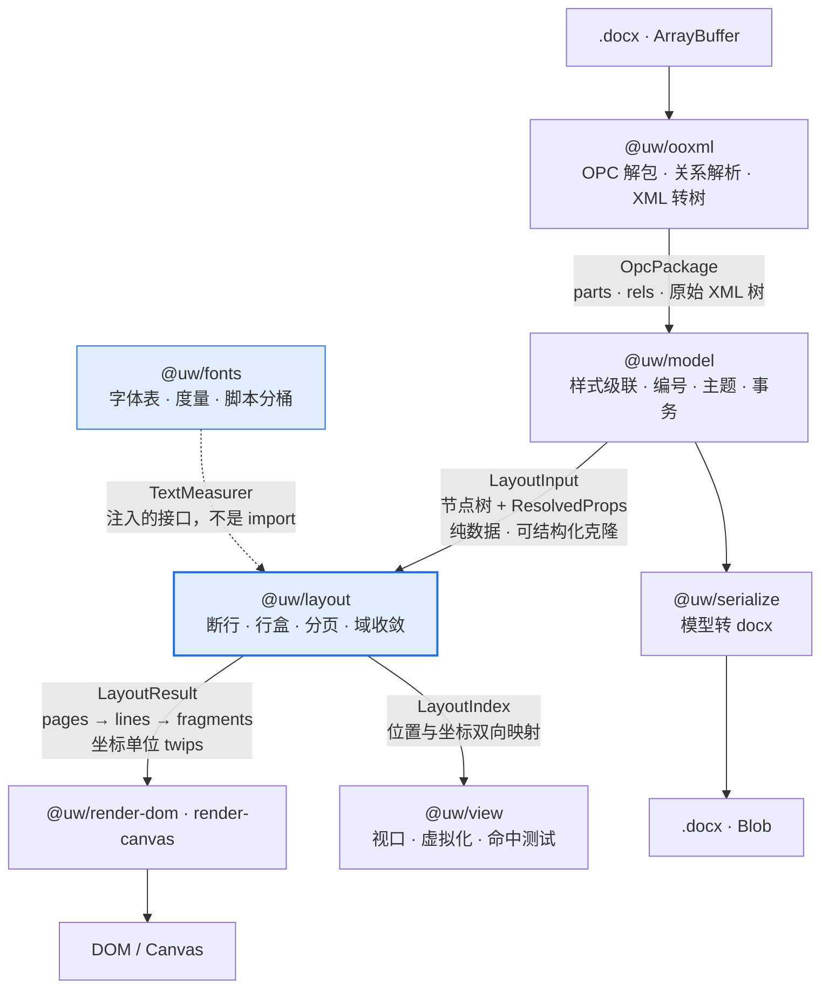
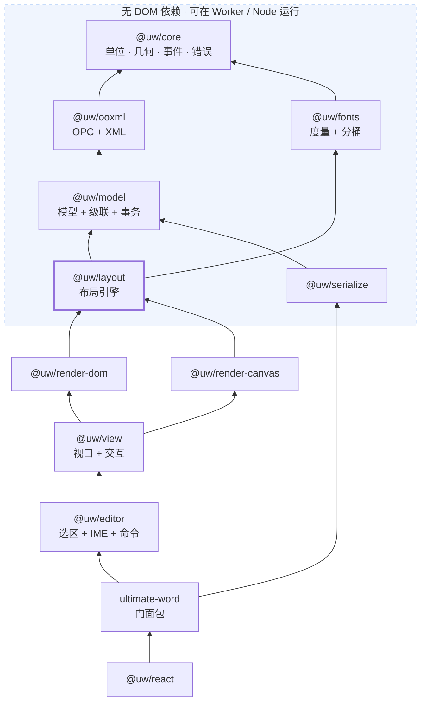
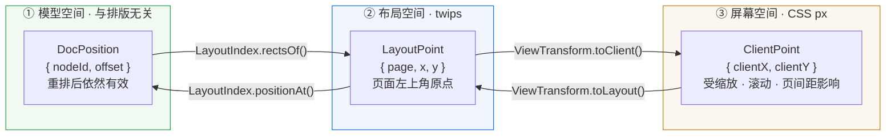
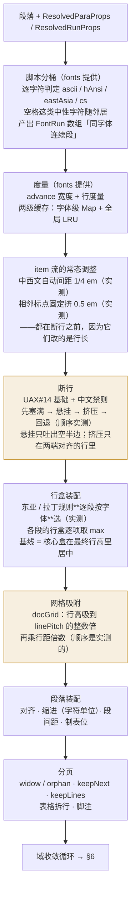
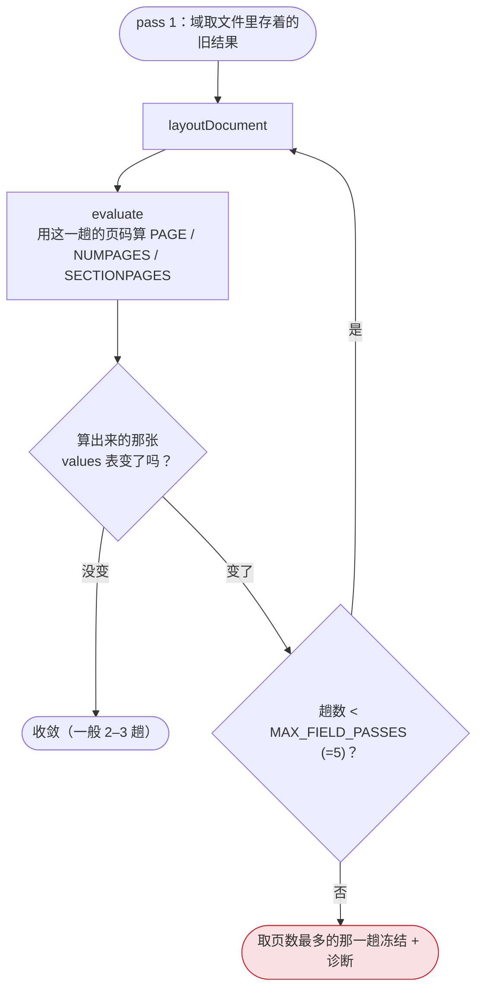
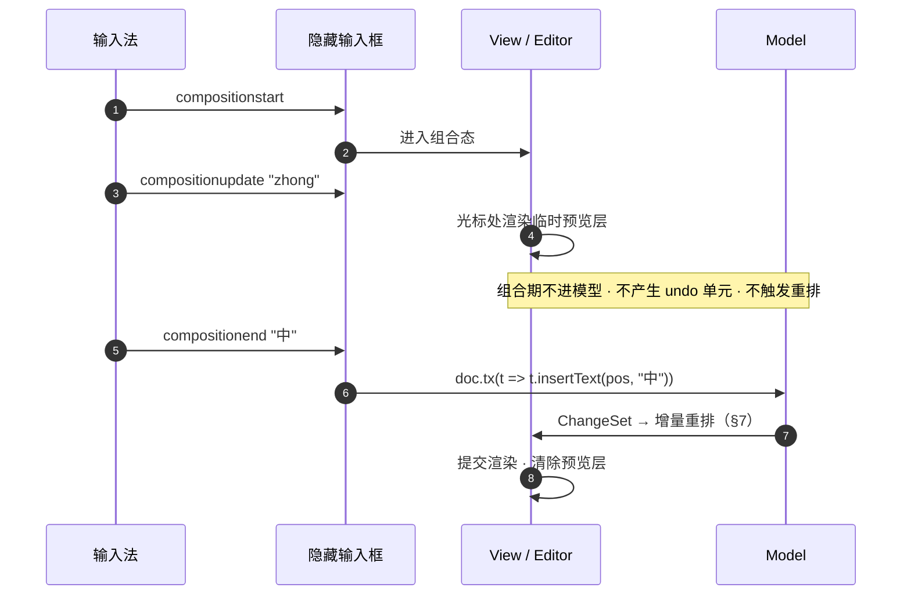

# 架构设计

> 配套文档：[开发计划](DEVELOPMENT-PLAN.md)（做什么、什么顺序）· [API 设计](./api.md)（对外长什么样）
>
> 本文只回答一个问题：**为了让「自己算排版」这件事在工程上站得住，代码该怎么切。**

---

## 0. 一句话概括

**这个库是一个编译器。** 源语言是 OOXML，目标代码是屏幕上的坐标。

这不是比喻，是实际的架构约束。编译器的那套纪律——阶段之间只传不可变的纯数据、
每个阶段可单独测试、后端可替换、中间表示可序列化——正是这个项目能做下去的原因。
反过来，任何「布局的时候顺便读一下 DOM」「渲染的时候回头改一下模型」的捷径，
都会在增量排版或 Worker 化的时候连本带利还回来。

```
.docx 字节  →  OPC 包  →  文档模型  →  布局结果  →  DOM / Canvas
              ────────    ─────────    ─────────
              解析前端     语义中间表示   目标代码
```

---

## 1. 五条设计原则

每条都配了「违反会怎样」——不是格言，是踩过或预见到的具体故障。

### 1.1 阶段之间只传纯数据

阶段的输出必须是**可结构化克隆**的普通对象：没有类实例的方法、没有闭包、
没有对 DOM 节点的引用、没有对上游对象的反向指针。

**为什么**：这一条同时买到三样东西——布局能挪进 Worker、布局能换成 Rust/WASM、
每个阶段的输出能当 golden file 存进仓库做回归。三样都是后期想加就来不及的。

**违反会怎样**：`LayoutResult` 里塞一个指向 `HTMLElement` 的引用，
Worker 化那天要重写整个布局层的数据结构，而那时它已经有一万行了。

### 1.2 布局层不认识 DOM

`@uw/layout` **不得** import 任何 DOM API。它需要测量文本时，用的是注入进来的
`TextMeasurer` 接口，实现由 `@uw/fonts` 提供。

**为什么**：见 1.1。另外这让布局能在 Node 里跑——这是保真度测试能自动化的前提。

**违反会怎样**：布局里出现一次 `document.createElement` 来测宽度，
整个布局层就再也不能在 Worker 和 Node 里跑，保真度回归只能靠人肉看截图。

### 1.3 单位只有 twips，px 只在出口

布局全程 twips（1/1440 英寸），只有渲染器的最后一步转 px。
转换函数集中在 [`@uw/core/units.ts`](../packages/core/src/units.ts)。

**为什么**：OOXML 原生就是 twips / 半磅 / EMU，用它做累加不引入换算误差。
更重要的是——**缩放因此不是布局的输入**，见 §4 的推论。

**违反会怎样**：行高用 px 累加，50 行之后累计漂移 0.4pt，最后一行溢出版心，
而且这个 bug 只在特定字号下出现，查一整天。

### 1.4 未识别的 XML 必须原样保留

解析时遇到不认识的元素/属性，挂到节点的 `raw` 上；回写时原样吐回去。

**为什么**：round-trip 安全是这类库的信誉底线。用户加载→不编辑→导出，
拿到的文件在 Word 里必须不弹「文件已损坏，是否修复」。

**违反会怎样**：用户的文档过一遍我们的库就丢了修订记录 / 书签 / 自定义 XML 部件。
这种 bug 一旦出现，用户不会给第二次机会。

### 1.5 真值是架构的一部分，不是测试工具

`apps/fidelity` 产出的 `*.truth.json` 是 Word 排版结果的**坐标级真值**，
它直接约束了 `LayoutResult` 的数据形状：必须能逐行、逐片段地和真值 diff。

**为什么**：见 Phase 0 的经历——关于行高我最初有两个都自洽的假设，
靠肉眼看截图永远分不开，是靠两款度量差异极大的字体 + 0.001pt 精度的坐标真值才判定的。

**违反会怎样**：布局写完了，「看起来挺像的」，但没人能回答「差多少」，
于是每个 bug 都是无限期悬案。

---

## 2. 编译流水线与阶段契约



每个阶段的契约、失败模式与可测试点：

| 阶段 | 输入 | 输出 | 失败模式 | 怎么测 |
|---|---|---|---|---|
| `ooxml` | 字节 | `OpcPackage` | zip 损坏 / 不是 OOXML → **抛异常** | 解包后 part 清单快照 |
| `model` | `OpcPackage` | `LoadedDocument`（`loadDocument()`） | `basedOn` 成环、引用缺失 → **诊断，不抛** | 属性树 dump 与 Word「显示格式」面板抽查一致 |
| `fonts` | 字体字节 / 度量包 | `FontMetrics` · `TextMeasurer` | 字体缺失 → **三级降级**（见 §5.3） | 硬编码实测值的单测（跨平台可跑） |
| `layout` | `ResolvedBody`（或单个 `ResolvedParagraph` / `ResolvedTable`）+ `TextMeasurer` + 域（`FieldRegion[]`） | `DocumentLayout`（pages → blocks → lines → fragments，**有 y**）；单块入口仍产出不带 y 的 `ParagraphLayout` / `TableLayout` | 域不收敛 → 撞上迭代上限后**取页数最多的那一趟冻结** + 诊断 | 与 `*.truth.json` 逐行 diff（L0–L4 分级） |
| `render-dom` | `DocumentLayout` | 元素树（纯数据）→ 标记文本 / 真 DOM | —— | **属性里的坐标与 `*.truth.json` 逐行 diff**（比 `LayoutResult` 又晚一步，能照出「翻译」阶段丢的偏移）+ 截图回归 |
| `serialize` | `Document` | `.docx` | —— | round-trip：加载→导出→Word 打开无修复提示 |

**关键的一条**：`model` 阶段对内容问题采取「**诊断而非异常**」。
一份公文里有一个我们不认识的 `w:sdt` 变体，正确的行为是渲染出其余部分并记一条诊断，
而不是整个文档白屏。只有**结构性**错误（不是 zip、缺 `document.xml`）才抛。
这条策略一直贯穿到 API 层的 `doc.diagnostics`，见 [API 文档](./api.md#12-诊断与错误)。

---

## 3. 包依赖图



依赖方向**严格单向**，箭头指向被依赖方。虚线框内是无 DOM 依赖区——
这条线就是未来的 Worker 边界，也是 Rust/WASM 的替换边界。

### 3.1 为什么这样切

几个不那么显然的切分决策：

**脚本分桶放在 `fonts` 而不是 `layout`。**
`w:rFonts` 的四属性分桶（ascii / hAnsi / eastAsia / cs）本质是**字体选择策略**，
不是排版算法。放 fonts 里，layout 拿到的就是已经切好的 `FontRun[]`
（「同一款字体的连续字符段」），断行算法不必知道 rFonts 是什么。

**域解析劈成两半。**
域的**语法**（`{ PAGE \* MERGEFORMAT }` 怎么解析）属于 model；
域的**求值**（PAGE 等于几）依赖布局结果，属于 layout 的收敛循环（`layout/src/fields.ts`）。
把这两件事放一起，会让 model 反向依赖 layout，破坏单向依赖。

**`view` 依赖 `render-*` 而不是与之并列。**
视口虚拟化需要知道「这一页现在是不是真的画出来了」，
所以 view 是渲染器的**调度者**，不是它的同级。

**`editor` 依赖 `view` 而不是直接依赖 `model`。**
选区、光标、IME 全都是**屏幕**概念（「光标在哪」首先是个像素问题），
命令执行时再翻译成模型事务。反过来做会得到一个不知道自己在屏幕哪里的编辑器。

### 3.2 现状

| 包 | 状态 |
|---|---|
| `@uw/core` | 🟢 `units.ts` · `errors.ts`（`UwError`）· `diagnostics.ts`（`Diagnostic` / `DiagnosticSink`） |
| `@uw/fonts` | 🟢 行高规则 + 基线位置（两次穿刺实测标定）· **东亚 / 拉丁规则按字体选**（`eastAsianFont()`，`spike-script-01` 标定）· 混排行的行盒合成（`composeLineBox()`，同一份样本）· 脚本分桶（**四条规则全部实测标定**：歧义字符跟 `w:hint`、中性字符只有空格随邻居且与 hint 无关，`spike-width-01`，见 §5.2）· 度量包（**17 款已抽取入库**）· 注册表（三级降级）· `TextMeasurer` + 两级缓存 |
| `@uw/ooxml` | 🟢 OPC 解包 · 内容类型 · 关系 · 保序 XML 纯数据树 + 反向序列化 |
| `@uw/model` | 🟢 样式级联（含编号层与表格样式层）· 主题字体 · 正文节点树 · 分节 · 设置 · 字体表 · 编号（解析 + 计数器 + 编号文字）· 表格（属性 + 级联 + `w:tblStylePr` 条件格式**（层序实测标定）** + `w:tblPrEx` 行级例外）· 域的结构还原（界桩配对 + 指令解析 + HYPERLINK；**求值在 layout 那一侧**，见 §6）· **页眉页脚部件**（按引用解析 + 各带 id 前缀 + 单独级联）· **图片**（`w:drawing` / VML `w:pict` 的外框 + blip 引用 + 裁剪 / 旋转 + 浮动锚点；字节按引用收进 `LoadedDocument.images`） |
| `@uw/layout` | 🟢 断行（禁则 / 挤压 / 悬挂，四条补救顺序与三个常数全部实测标定）· 缩进（含字符单位）· 对齐 · 制表位 · 列表编号 · 行高 + 网格吸附 + **行内基线** · 表格列宽与格内几何 + 边框冲突解析（**格线几何与相邻竞争都已实测标定**：横向不吃宽、纵向吃高；竞争先分类再比厚度，见 §5.6）· **分页**（`layoutDocument()`：页面几何 · 分节 · 孤行寡行 · keepNext / keepLines · 硬分页符 · 表格按行拆页 · 页码，见 §5.4）· **域求值**（`layoutDocumentWithFields()`：PAGE / NUMPAGES / SECTIONPAGES 迭代到自洽，见 §6）· **页眉页脚**（选哪一份 · 框的定位 · 反过来挤版心，三条几何规则实测标定，见 §5.4）· **对象**（内嵌图占宽占高，行盒四条规则与浮动图的参照框全部实测标定，见 §5.5；**带 `wp:anchor` 的图**一律不占文字流、按锚点算成纸坐标）· **表格拆行**（`table-split.ts`：一行放不下时从行间切开，`w:cantSplit` 与表头行除外；**四条规则全部实测标定**，见 §5.4）· **中西文自动间距**（**1/4 em，实测**，按接缝前面那个字符的字号算，见 §5.2）· ⏸ 方形 / 上下型环绕的**文字让开**未做（位置与大小是对的，文字不绕着它走）|
| `@uw/render-dom` | 🟢 v1：一页一个 `<svg>`（viewBox 单位 **pt**）· 逐字 x 走 `<text x="…">` · 下划线 / 删除线 / 上下标 / 横向缩放 · 制表位前导符 · 表格底纹 + 格线（共享的线只画一次）· 页眉页脚（与版心平级的两个框）· 缩放只改 `<svg>` 尺寸不重排 · **图片**（`<image>` + 裁剪 `clipPath` + 旋转翻转；画不出来的画尺寸正确的占位框）· ⏸ 可选文本层 / 增量更新 |
| `@uw/render-canvas` `@uw/view` `@uw/editor` `@uw/serialize` `ultimate-word` `@uw/react` | ⚪ 未创建 |

---

## 4. 三个坐标空间

排版库最容易长成一团乱麻的地方就是坐标。这里**只允许存在三个空间和两个转换**。



- **谁拥有哪个转换**：`LayoutIndex`（layout 产出）拥有 ①↔②；`ViewTransform`（view 拥有）负责 ②↔③。
  模型层**永远不知道像素**，渲染层**永远不知道 DocPosition**。
- **命中测试**是 ③→②→① 的两跳。因为布局结果里有每个片段精确的 x/y/w/h，
  ②→① 只是一次二分查找，不依赖 `caretPositionFromPoint` 那种浏览器 API。

### 4.1 一个重要推论：缩放永不触发重排

因为缩放只作用在 ②→③ 这个转换上，`LayoutResult` 完全不变。由此：

- 缩放是 O(1) 的 CSS transform，不是 O(文档长度) 的重排
- **一个 `Document` 可以挂多个 `View`**（比如主视图 + 缩略图侧栏），共享同一份 `LayoutResult`
- 打印不需要「按打印尺寸重新排版」——文档自带页面设置，屏幕和纸上是同一份布局

这三条都是「px 只在出口」这一条原则**白送**的，不需要额外设计。

---

## 5. 布局引擎内部

`@uw/layout` 是全项目的核心，也是唯一值得展开画的包。



橙色标注的两步是**中文公文保真的胜负手**，也是 docx-preview / OnlyOffice 都没做全的地方。

### 5.1 行高与基线：两次穿刺都已标定

行盒装配这一步的核心公式**已经实测定死**，实现在
[`packages/fonts/src/metrics.ts`](../packages/fonts/src/metrics.ts)：

| 这段文字用的字体 | 单倍行距行高 | 行顶到基线 |
|---|---|---|
| **东亚字体** | `(winAscent + winDescent) × 1.3 × 字号 / em`，**不加**外部行距 | `winAscent × 字号 / em` + 额外行距的**一半** |
| **拉丁字体** | `(winAscent + winDescent + GDI 外部行距) × 字号 / em` | `(winAscent + 外部行距) × 字号 / em`（外部行距**整块**在基线以上） |

行高 13 个样本最大误差 0.132pt，基线 30 个样本最大误差 0.140pt。
完整推导、残差表与三个附带结论（网格吸附在行距倍数之前、混排行的行盒怎么合成、
空段落走 ascii 桶）见 [开发计划 §2.1](DEVELOPMENT-PLAN.md)。

⚠️ 表头那一列原来写的是「**含东亚文字**的行 / **纯拉丁文字**的行」——
判据是**字体**而不是字符，2026-09-05 由 `spike-script-01` 实测改正
（`@uw/layout` 的 `SCRIPT_RULES`）。一行只有「A2C6」四个半角字符、用等线画的，
Word 照样按东亚规则给行高，差 30% 且**每一行**都差。原来会写错是因为 Phase 0 那 13 个
样本里纯拉丁的行用的是 Times New Roman —— 「字符是拉丁的」与「字体是拉丁字体」
在它们身上完全重合。同一份样本还钉死了**混排行的合成**：几款字体各自的行盒
**逐项取 max**（上取最高、下取最深），不是「取各自行高的最大值」——
等线与宋体同行时 Word 给的行高比**两款字体各自的行高都大**。

两条公式可以合并成一句话，代码里就是这么写的：**「核心盒」在最终行高里居中**。
核心盒 = win 跨度（拉丁的话再加上外部行距）。于是行距倍数与网格吸附
拉出来或压掉的空间，一律上下均分，不需要为每种来源各写一条规则。

**唯一的例外是固定值行距**（`w:lineRule="exact"`）：那时基线 = **行高 × 0.8**，
与字体、字号都无关（`baselineOffsetExact`，`spike-baseline-04` 六个样本比例 0.8002–0.8009）。
本文档早先把固定值行距也算进「一律均分」，那是**推**出来的而不是测出来的 ——
前三份基线 fixture 的行距全是单倍 / 倍数 / 网格，固定值那一格是空的。
是分页样本（固定行距 20pt）整页低了 1.77pt 才把它逼出来。

行盒有了 `baseline` 之后，页与 y 由分页补上（§5.4）：段落的坐标原点仍是它自己的左上角，
行的 y 靠把前面各行的 `height` 累加得到 —— 这个累加**已经用真值验过**，
gongwen-01 的 18 行基线 y 与 Word 最大差 0.06pt。

### 5.2 宽度那一维：分桶、空格、中西文间距

行高（§5.1）决定行与行之间隔多远，这一节决定**一行里能放下多少字** —— 也就是断行点。
四条规则都由 `spike-width-01` 实测标定（3 页 31 行，144 种组合唯一满分，
规则表与证据在 `@uw/layout` 的 `WIDTH_RULES`）。

**① 歧义字符跟着 `w:hint` 走，与邻居无关。**
Unicode 把 `§ ° ± × ÷ · ① ※ ℃ Ⅰ` 这些字符标成 EastAsianWidth = **A**（Ambiguous）——
「东亚环境下算全角，其他环境算半角」，而 `w:hint` 要回答的正是「这份文档算不算东亚环境」。
实测：同样一段 `B§B°B±B`，hint=eastAsia 时 `§ ° ±` 由宋体画（各 1 em），
hint=default 时由 Times 画（0.50 / 0.40 / 0.55 em）——**一个字差半个字宽**。
两侧的邻居是汉字还是拉丁字对结果没有任何影响。

**② 只有空格随邻居，而且与 `w:hint` 无关。**
四个桶按码点分，ASCII 空格一律进 ascii 桶，于是拿 Times 的 0.25 em 去量。真值说不对 ——
gongwen-01 的 12 个空格里**只要任一侧的邻居是东亚字**，Word 量到的都是 0.5 em
（仿宋自己的空格宽）。原来这条还附带一个「要 hint=eastAsia」的条件，那是猜的：
实测 hint=default 时照样是 0.5 em。同一份样本还说明 `/` `-` 这类中性字符**不随**邻居，
两种 hint 下都老老实实待在 ascii 桶里。

架构上值得记一笔的是**这条规则为什么不能放进 `splitFontRuns()`**：
`' 2026 '` 与 `'年起，'` 是两个 run，那个空格的东亚邻居在**另一个 run 里**，
而切段函数只看得见一个 run 的文字。所以分工是：

- **策略在 fonts**：`neutralTakesEastAsia(hint, prevScript, nextScript)` —— 判断在哪，
  依赖方向不变（layout → fonts）
- **应用在 layout**：`items.ts` 的 `applySpaceFont`，与 `applyAutoSpace` / `applyPunctPairs`
  并列，都是「item 流建好之后再扫一遍」的后处理。段落的 item 流正是**邻居齐全**的地方

这也是「后处理三件套」这个模式的第三个成员：凡是要看邻居才能定的量（中西文间距、
相邻标点挤压、空格的字体），都在 item 流上做，而不是在切段或度量里做。

⚠️ 空格还是**唯一不能按真值里的字体名读的字符**：Word 画它时不换 `Tf`，
PDF 里它跟着前一个字的字体走，而推进宽度才是另一款字体的。按字体名读会得出
「空格只跟前一个字」这个相反的结论 —— 标定这一条只能靠宽度。

**③ 中西文自动间距是 1/4 em，不是 1/8。**
本文档与开发计划 §2.2 一直写着 1/8，那是从别处抄来的说法，**从来没有过真值**
（gongwen-01 的中西文之间本来就打了空格，量不到这个数）。实测 36pt 的 `中B中`
两侧缝隙各 9.03pt = 0.25 em。差的这 4.5pt 是**每一个中西文边界**都差，
混排行的断行点一路错下去。

**④ 那 1/4 em 按「接缝前面那个字符」的字号算**，不是东亚那一侧的。
把 `中`(36pt) + `E`(12pt) + `中`(36pt) 与它的镜像各排一遍，缝隙是 9.03 / 2.99 与 3.00 / 9.05 ——
两组互为镜像，「按东亚侧算」「按较大者算」都给不出这对数。

自动间距有两类例外，道理相同（**那一侧自己就带着空半边，再加就成了双份**）：
**全角标点旁边不加**（早先由 gongwen-01 实测），以及**靠 hint 才进东亚桶的歧义字符旁边也不加**——
所以判据是**码点**（`isEastAsianCodePoint`）而不是分桶结果。

### 5.3 度量的三级降级

```
① 真实字体文件（fontkit 解析 OS/2 · hmtx · cmap）        ← 与 Word 一致
② 度量包 JSON（离线从 Windows 字体抽的纯度量，1.7–7.1 KB/字体） ← 与 Word 一致，17 款已入库
③ 兜底近似                                              ← 仅未知字体，页数可能对不上
```

①② 已实现：`FontRegistry` + `FontSource`（`fontkitSource` / `metricsPackSource`），
`status()` 报 `file` / `metrics` / `fallback` / `missing` 四态。

关键认识：**跨平台需要的只是度量，不是字形**。非 Windows 平台用替代字体**渲染**、
用真实度量**排版**，断行点与页数就和 Word 完全一致，只是字形外观不同。
这比想办法凑齐字体授权现实得多。

#### 写明的洞：级别③ 归谁

本文档早先版本把级别③ 写成 `canvas.measureText`，**那和原则 1.2 冲突**：
canvas 是 DOM API，而 `@uw/fonts` 在虚线框内的无 DOM 区，调不到它。

现在 `measurer.ts` 里的级别③ 是**等宽近似**（东亚全角、其余半角，形状照宋体家族），
只保证版面不崩，不保证与 Word 一致，每命中一款就记一条 `font-missing` 诊断。
这是权宜之计 —— 等宽假设的误差随文本长度累积，一段长英文能偏出好几个字符宽。

三条出路，原文写的是「Phase 3 渲染层落地后再定」。**渲染层已经落地了**（§5.7），
答案是第三条，而且理由比原先预想的更硬：渲染器根本不参与度量 ——
它拿到的 `LineFragment` 里每个字的 x 都是算好的，画的时候连字体有没有装都不问。
于是「级别③ 上移到渲染层」这条路自己消失了（渲染层没有度量能力可上移），
剩下的只是「度量包覆盖不到时怎么办」这一个可测的问题。

| 方案 | 代价 |
|---|---|
| 把 `measureText` 做成注入的 `FallbackMeasurer` | fonts 保持无 DOM；但异步字体加载会让度量在首帧不稳 |
| 级别③ 整个上移到渲染层，layout 只认 ①② | 分层最干净；但 layout 拿不到宽度时无法产出 `LayoutResult` |
| 随库带一份「常见中文字体」的度量包，把③ 压缩成极少数情况 | ✅ 已做：`packages/fonts/packs` 17 款 88KB，A/B/C/D 分级见开发计划 §2.1 |

倾向第三条 —— 它把问题从「近似得准不准」变成「有没有覆盖到」，后者可测。

### 5.4 分页：y 是在这里补的

`layoutDocument(resolvedBody, { measurer, settings })` → `DocumentLayout`：
`pages → blocks（PlacedParagraph / PlacedTable）→ lines / rows → fragments`。
每一行的绝对基线 = **`page.geometry.content.y` + `PlacedLine.y` + `LineLayout.baseline`**，
三个数分别来自这一页的版心（`w:pgMar` 再减掉页眉页脚，见下）、逐行累加、基线穿刺的公式。这条拼法在 gongwen-01 的 18 行上
最大误差 **0.06pt**（L3 判据 0.5pt），也就是说**逐行累加不需要「每页重新对齐网格」的修正** ——
网格吸附已经吸在每一行的行高上了。

三个刻意的设计：

- **段落仍然不带 y。** 分页只往上加一层「这一片在第几页的什么高度」，段落布局本身可缓存；
  跨页的段落在两页上各出现一片，靠 `first` / `last` 与 `PlacedLine.index` 缝回去
- **页是惰性开的**（`Flow.page === undefined` 表示「下次放东西时才开」）。
  这样文末的硬分页符不会凭空多出一张空页，空节也不会留下垃圾页；
  真正要空页的只有 `evenPage` / `oddPage` 补的那种，它带 `filler` 标记。
  唯一的例外是「这一页还剩多高」——问了就说明真要往里放东西，所以那一问顺手开页
  （页眉进来之后这一步是必须的：剩多高得看**这一页自己的**版心）
- **keepNext 是「接缝」而不是「整块」**：本块末行与下一块首行必须同页，所以排本块时
  就把接缝高度算进可用高度（`joinHeight`）。按「整块原子」实现会平白把一整段推到下一页

三条分页规则本身**都已用真值标定**（`spike-page-01/02`，落在 `page.ts` 的 `PAGINATION_RULES`）：
孤行寡行保底 2 行、段前间距落在页首不算、keepNext 的接缝按「下一块最少能放多少」留。
标定方式与别处不同 —— 分页规则不是一个数而是三条互相纠缠的判断（孤行寡行会先一步把段落推走，
keepNext 的接缝又得看下一段肯不肯拆），单独反推任何一条都会被另一条污染，
所以是把 3 × 2 × 3 种组合排开逐页比对，取唯一满分的那一组（50/50 页）。

**页眉页脚也已经做完，而它改写了「版心」的定义**：原先这份文档写的是「版心 = 纸减页边距」，
真值把它推翻了 —— **页边距是最小值不是固定值**。版心顶 = max(`w:top`, 页眉底)、
版心底 = min(纸高 − `w:bottom`, 页脚顶)，于是同一节里各页的版心可以不一样高（首页页眉与
偶数页页眉长度不同就够了），`PageGeometry` 因此是**每页一份**而不是每节一份。
另外两条同样是实测的：页眉框顶 = `w:header`（到纸顶），页脚量的是框**底**
（框底 = 纸高 − `w:footer`）—— 两者**不对称**，按对称写会让页脚整体偏一个页脚高度。
标定方式与分页规则同一个路子：`spike-header-01`（矮，放得下）与 `spike-header-02`（高，放不下）
除页眉页脚行数外逐字相同，8 种组合逐页比对，唯一满分（12/12 页，含 `spike-header-03` 的
「首页 / 奇偶」选择与页脚里真的 `{ PAGE }`）。

顺带被它逼出来一个**原有的洞**：`availHeight()` 从前在 `breakPage()` 之后读的是「节的纸面几何」，
页眉进来之前那两份恰好相等，所以一直没露出来 —— 页眉一挤版心，跨页的长段落就会在第二页多收一行。

表格**拆行**（`table-split.ts`）也做完了：一行放不下时从**行间**切开，本页一片、下一页接一片，
`w:cantSplit` 与表头行（它每页都要重复一遍）除外。切出来的是**两份各自自洽的 `RowLayout`**
而不是「一份 + 裁剪窗口」—— 后者要渲染层加 `clipPath`、要命中测试懂「这一片只露出第几行」，
还要一套行内局部坐标；在布局里切完，渲染层一个字都不用改。它修掉的是一个真会错位的洞：
一行高过整页版心时，原来只能硬塞、内容溢出版心且后面每页跟着错。

表格的**几何**在 2026-08-26 第一次跟 Word 比（`spike-table-01/02`，见 §5.6）。照出的那条错
（水平格线不占高度）同时改了拆行：切出来的头片带着自己上边那条格线。

**拆行本身的四条规则在 2026-08-27 才有真值**（`spike-table-04`，14 页七张表，
跑 `pnpm --filter @uw/fidelity spike:table-split`；16 种组合逐页比，唯一满分）。
原来那四条是「哪种最省地方」猜的，**三条是反的**，而且每一条都改分页 ——
按原来那版排，14 页的样本只对得上 3 页：

| 问 | 原来猜的 | Word |
|---|---|---|
| 切在哪一页 | 整行挪到下一页顶上再切 | **就地切**，本页剩下多少用多少 |
| 单元格上下边距 | 上归头片、下归尾片 | **两片各补一整份** |
| `w:trHeight` 的富余 | 整行算完，富余归尾片 | **每一片各要一份** |
| 头片的 `w:vAlign` | 一律 top | **照原样** |
| 接缝上画不画线 | 不画（渲染层的开关） | **画**，而且取**表级**的上下边框 |

「每一片各要一份 `w:trHeight`」顺手把两件本来要单独立规则的事变成了推论：
**一片都满足不了那个高度时整行挪走**（`placeTable()` 里的 `need`），以及
**要的高度大过整页版心时续页顶上不重复表头**（挤不下了）。
接缝那两条线由布局层写进切片的 `cell.borders`，渲染层照常画 —— 原来 `@uw/render-dom`
的 `SPLIT_ROW_SEAM_BORDER` 开关连同它的猜测一起删了，这也是「阶段之间只传纯数据」
（原则 1）的一次兑现：新规则没有给渲染层加任何一个分支。

未做且写明的洞：脚注与浮动对象不占位；页眉页脚的**选择**规则里有四问按规范实现但没有样本，
写在 `header-footer.ts` 的文件头。拆行剩下的三处没有真值（头片为不为接缝那条线预留高度、
拆开的行自己写了 `w:tcBorders` 时接缝听谁的、接缝线与重复表头撞在同一个 y 上画哪一条）
写在 `table-split.ts` 的文件头 —— 它们**一个都不改断行**。

### 5.5 对象（图片）的几何：坐在基线上的是「盒」不是图

内嵌图在行盒里怎么摆，四条实测规则（样本 `spike-image-01` 与 `spike-image-03`，
79 张图、图高 4→90pt 四条阶梯，最大偏差 **0.340pt**，实现在 `line-height.ts` 的
`OBJECT_RULES` 与它下面的 `advance()`）：

1. **对象占的高度 = 图高四舍五入到 1.5pt 的整数倍，且不小于图高**（`objectBoxHeight`）。
   于是坐在基线上的是这个**盒**，图在盒里靠上放 —— 图底最多浮在基线以上 0.75pt。
   机理不明（1.5pt = 96dpi 下的 2 个像素），但规律钉得很死：0.1pt 步长的微阶梯里，
   30.7pt 的图占 30.77pt，30.8pt 的图整个跳到 31.5pt 并一路平到 31.5pt，台阶边就在半格上
2. **文字自己的下伸留着**：行高 = 盒高 + 文字下伸，不是盒高本身。
   仿宋 12pt 的下伸是 3.52pt，22pt 的是 6.41pt —— 跟着字号走，不是常数
3. **`w:position` 对图片照样起作用**，且行盒跟着变（压低 6pt 的那一行下伸变成 6pt）
4. **含图的行照样吸行网格**（吸的是「盒高 + 文字下伸」，富余仍旧上下均分），
   但**倍数行距不乘在图撑起来的那一截上** —— 两侧分算：文字侧「吸附 → 乘倍数」，
   对象侧「对象要的高 + 倍数按**自然**行高多留的那段空白 → 吸附」，取大者作行的推进量，
   基线在**赢的那一侧的行盒**里居中（对象侧的行盒不含那段空白）。
   这一条是 `spike-image-03`（2026-08-26）照出来的**实现错误**：网格 31.8pt + 1.5 倍 +
   40pt 的图，按「合成一个自然行高再乘」得 95.4pt，Word 给的是 63.6pt。
   原来 01 / 02 两份样本都关着网格，而中文公文一律开着网格，这个洞才一直没露出来

前三条合起来落到数据上只剩一个数：`LineObject.raise` = 对象底边高于基线多少
（= 盒高 − 图高 + `w:position`）。渲染层拿到它就够了，不必知道量化这回事。

浮动对象（`wrap="none"`）的参照框八种，同样全部实测（样本 `spike-image-02`，
实现在 `page.ts` 的 `FLOAT_ORIGIN_RULES`）。两条与「照规范猜」不一样：

- **纵向的 `insideMargin` / `outsideMargin` 镜像的是上下页边距**，不是版心 ——
  奇数页 inside = 上页边距框，偶数页 = 下页边距框。原来退到版心，差着一整个上边距
- **`character` 参照的是锚点前一个字**的左边缘，不是锚点自己

### 5.6 表格的几何：格线在纵向占位、在横向不占

表格这一层到 2026-08-26 才第一次跟 Word 比（样本 `spike-table-01/02`，跑
`pnpm --filter @uw/fidelity spike:table`）。在那之前列宽、格内边距、行高、`w:vAlign`、
跨列格的可用宽**全是照规范推的** —— 而它们一错就是整份文档往下错位，比字体度量差半磅严重。

一跑就照出一条真错的：**水平格线占纵向的高，竖格线不占横向的宽**。原来两个方向都按
「不占」写，于是每张带框的表都偏矮 —— 一张 20 行、0.5pt 框线的表少算 10pt，1pt 框线少 20pt，
跨页位置一路错下去。不对称的原因看一眼就明白：**宽度是给定的**（`w:tblGrid` 是 Word 存盘时
算完写下的），边框没地方可占；**高度是算出来的**，边框就能加进去。

证据（样本页 1，仿宋 12pt 单倍行距 = 15.6pt，框线 0.5pt，第 5 行第一格 6pt）：

| 量的东西 | Word | 模型 |
|---|---|---|
| 第 1 行 → 第 2 行 基线差 | 16.08pt | 15.6 内容 + 0.5 格线 |
| 第 4 行（`w:trHeight` 60pt）→ 第 5 行 基线差 | 66.00pt | 60 + 6.0 格线 |
| 第 5 行末行 → 第 6 行 基线差 | 21.60pt | 15.6 + 6.0 格线 |
| 表前一段 → 第 1 行 基线差 | 16.08pt | 15.6 + 0.5（表**顶**那条也占） |
| 表末行 → 表后一段 基线差 | 16.08pt | 15.6 + 0.5（表**底**那条也占） |
| 6pt 边框那一格的断行 | 9 字/行 | 可用宽 109.2pt 未被吃掉（吃了只剩 8 字） |
| 6pt 边框那一格的文字 x | 与同列其余行**相同** | 横向一点不占 |

落到数据上是两个新字段：`RowLayout.gridAbove`（本行**上边**那条线，已经含在 `height` 里）
与 `TableLayout.gridBelow`（表最下面那条，不属于任何一行）。「一行带上边那条」与
「一行带下边那条」不是两个候选而是**同一个答案** —— Word 存盘时总把共享的线在相邻两格上
各写一份，两种记法算出来的行间距一模一样。`w:trHeight` 与 `w:vAlign` 量的都是**格线以内**
那一段：第 4 行 `w:trHeight` = 60pt，三格的基线差实测 0 / 22.20 / 44.52pt，
正是 (60 − 15.6) 的 0 / 一半 / 全部。

顺带验完、本来就对的几条：默认单元格边距真的是 108 twips（来自 `Normal Table`，不是规范常数）、
`w:tcMar` 覆盖表级、跨列格按合并后的宽度断行、`w:jc="center"` 与 `w:tblInd`。

**剩一处没有模型**：Word 把格内文字在「格左边 + `w:tcMar`」之外再往右挪一点点 ——
边距 5.4pt 时 0.32pt、20pt 时 0.24pt、**0 时 0.59pt**。三个数凑不出规则（不是常数、
不是比例、也不是「至少多少」），所以留 0 不硬凑，关在 `uncalibrated.ts` 的
`TABLE_CELL_TEXT_INSET`；它也是 `spike:table` 123 段里唯一对不上的那一段。

**相邻竞争**（共享一条线的两个格子各写了一条边框，画哪一条）到 2026-08-27 才有真值
（样本 `spike-table-03`，跑 `pnpm --filter @uw/fidelity spike:table-border`）。原来照
CSS 2.1 §17.6.2 的 collapsing borders 类比写成「线宽 → 样式权重 → 左上者」，**错了一半**：

| 组 | 左 / 上 | 右 / 下 | Word 画的 | 说明 |
|---|---|---|---|---|
| 八 | dotted 3.0pt | single 0.75pt | **蓝**（single） | 破折类再宽也输给实线 |
| 丙 | dashed 3.0pt | single 0.5pt | **蓝**（single） | 换成 dashed 一样输 |
| 戊 | dotted 0.5pt | dotted 2.25pt | **红**（细的那条） | 同一种破折线之间不比宽度 |
| 壬 | dotted 2.25pt | dotted 0.5pt | **红**（粗的那条） | 戊的镜像 → 赢的是**位置**不是宽度 |
| 丁 | single 3.0pt | double 1.5pt | **蓝**（double） | 双线画出来 4.32pt = 3 × `w:sz` |
| 九 | double 0.75pt | single 3.0pt | **蓝**（single） | 双线 2.16pt 厚 < 单线 3.0pt |
| 癸 | single 1.5pt | double 0.5pt | **蓝**（double） | 厚度都是 1.44pt → 样式权重再比一次 |
| 五 | single 1.5pt | single 1.5pt | **红** | 全平局取左上（横竖两个方向都是） |

于是实现的顺序变成：可见性（`nil` / `none` 输给一切）→ **线型分类**（点线 < 虚线 < 实线类，
跨类时线宽完全不算数）→ 同为破折类则直接看位置 → 实线类内部比**画出来的厚度** →
厚度打平比样式权重 → 仍平局取左上。21 组配对各做横竖两遍，42 条边全对，
`BorderConflictRules` 的 32 种组合里唯一满分。

这份样本还带出两条基础设施：真值多了一路 `pages[].rules[]`（画出来的线，从算子表读，
实线是填充矩形、虚线是带 dash 的描边），以及「**Word 造不出冲突的相邻边框**」这个事实 ——
它的对象模型里一条共享边只有一个 `Border` 对象，设一侧等于两侧都设，
所以样本里的冲突是**改 XML** 写进去的（`apps/fidelity/src/patch-docx.ts`）。
反过来说，真实语料里的冲突只来自别的生成器、粘贴、或 `w:tblPrEx`。

**条件格式的层序**用同一份 `spike-table-02` 标定：给每个条件设一个独一无二的字号，
于是「这一格最终几号字」= 「层序里最后一个命中它的条件是谁」，从真值的 `size` 直接读得出来，
不必从字形宽度反推。照出一条反的 —— `CONDITIONAL_ORDER` 原来写「行带在列带之后」，
实测是**列带盖行带**；而首末那一组方向**相反**（首末行盖首末列），不是一句「行优先」能概括的。
「一格命中哪些条件」是另一回事，用 Word 自己写在 `w:cnfStyle` 上的归属标记验过了，与实现一致。

造这份样本时还撞见一个**别的层**的问题：格子不带直接格式时字体是文档默认的等线，
一行纯 ASCII 的文字 Word 按**东亚**行高规则算（15pt 字给 20.32pt），我们按「行里有没有东亚字」
判、给的是 15.63pt。差 30% 且每行都差。当时一个数据点分不开三种说法，没有硬改；
2026-09-05 用 `spike-script-01` 单独造样本钉死了 —— 判据是「用的**字体**是不是东亚字体」，
见 §5.1 与 `@uw/layout` 的 `SCRIPT_RULES`。

### 5.7 渲染：一页一个 `<svg>`，viewBox 的单位是 pt

`@uw/render-dom` 把 `DocumentLayout` 翻译成元素树，是流水线的出口 ——
**px 只在这一步出现**（原则 1.3）。它分成两个入口，界线是碰不碰浏览器：
`@uw/render-dom` 主入口只到「纯数据元素树 → 标记文本」，`@uw/render-dom/dom`
才把树变成真 DOM（`Document` 是注入的）。

隔一层纯数据的树，而不是一路 `createElementNS` 画到底，买到三样东西：
**单测在纯 Node 里跑**（不需要 jsdom）、**截图回归的入口**（SVG 直接落盘，
`pnpm --filter @uw/fidelity preview` 就是拿它写 HTML 的）、
**与 Worker 化同构**（将来过界的正是这棵树）。

四个不那么显然的选择：

- **viewBox 的单位是 pt，不是 px 也不是 twips。** `fixtures/*.truth.json` 的单位就是 pt，
  原点也同样是纸的左上角、y 向下 —— 于是 SVG 属性里读到的 `y="119.05"` 与真值里的
  `y: 119.05` 是同一个数，`preview --truth` 把真值基线直接画上去连一次换算都不要
- **缩放只改 `<svg>` 的 width / height**，viewBox 一个字不动。§4.1 的「缩放永不触发重排」
  在这里落地成了一行属性
- **粒度 = 一行里的一个 run 片段**，逐字微调靠 `<text x="x1 x2 x3 …">`。
  一字一元素 DOM 会爆，一行一元素则没地方放挤压与两端对齐造成的偏移
- **视觉属性由布局带过来**（`LineFragment.style`），渲染层**不回头查模型**。
  包依赖是单向的，而且 Worker 化之后主线程手上只有 `DocumentLayout` 这一份数据

端到端的验收在 `packages/render-dom/src/fixture.test.ts`：拿画出来的 `<text>` 属性
直接跟真值比，L3 / L4 都在 0.5pt 内。它与布局侧的 `fixture.test.ts` **不重复** ——
中间隔着「twips → pt」「版心原点搬进 `<g transform>`」「逐字 x 拼成 x 列表」三步翻译，
那种错在布局侧的断言里一个都照不出来。

页眉页脚是与版心 `<g>` **平级**的另外两个 `<g>`（坐标相对纸左上角）——
它们不在版心里，版心正是被它们挤出来的，套进去会平白多偏一个上边距。

内嵌图的纵向位置由布局给的一个数决定：`LineObject.raise` = **对象底边高于基线多少**，
渲染时 `y = 基线 − 高 − raise`。渲染层不该知道「盒高按 1.5pt 量化」这回事（§5.5），
它没有行盒。

图片走 `<image>`：`href` 由宿主给的 `imageHref(id)` 回调决定（`imageHrefResolver(doc.images)`
给的是 data URI，浏览器里也可以换成 blob URL）—— **渲染层不认识 OPC 包**，
它拿到的只是一个 id。三处要点：`preserveAspectRatio="none"`（外框是用户拖出来的，
可以与图片本身不同比例）、裁剪要「放大后再用 `clipPath` 切」、旋转 90° 要把长宽比缩回去
（`wp:extent` 是转完的外接矩形）。浮动对象（`wrap="none"`）与版心 `<g>` 平级，
**衬于文字下方的画在正文之前、浮于上方的画在最后** —— SVG 里的「层」就是画的先后。

没画的：图表 / SmartArt / 形状与 EMF / WMF（画尺寸正确的虚线占位框，`alt` 进 `<title>`）、
run 级高亮（model 里没解析）、
可选文本层（Ctrl+F / 复制，属于 `@uw/view`）、增量更新（等增量排版，见 §7）。

---

## 6. 域的循环依赖与收敛

页码依赖布局 → 目录长度依赖页码 → 目录变长又改变布局。这是个不动点问题。

已实现：`layoutDocumentWithFields(resolved, fields, opts)`（`layout/src/fields.ts`），
认 **PAGE / NUMPAGES / SECTIONPAGES**；TOC / SEQ / STYLEREF 还没做，它们照旧显示
文件里存着的旧结果（那正是 Word 打开时的样子）。



两处与本文档**原先写的不一样**，都是实现时才想清楚的：

- **收敛判据是「入参那张表不再变」，不是「页数与域文本都没变」。** 求值结果不写回模型，
  而是外挂一张「run id → 显示的文字」交给排版当入参（写回去要每趟克隆一棵树，
  而且模型里就有了两份真相）。既然 `layout = L(values)` 与 `values' = E(layout)` 都是确定性的，
  `E(L(values)) === values` 就是自洽的充要条件 —— 比原来那个判据更严，
  「页数没变但某个 PAGE 域从 3 变 4」（内容在页之间挪了位置）不会被误判成收敛
- **A→B→A 的振荡检测没有实现**，原文说它「是必需品不是保险」，就现在这三个域而言说反了：
  域文字只会变宽、分页的每条规则又只会把内容**往后**推，于是页数对域文字宽度**单调不减**，
  回不了头。写了也是永远跑不到的死代码（跑不到 = 测不了 = 会烂）。防线是
  `MAX_FIELD_PASSES` 这个上限，撞上去就按「取页数较大者冻结」退出并记诊断。
  等 TOC 进来（目录能**变短**，单调性就没了）再补，那时才有样本能验证它 ——
  连同「目录项文本同一趟内只允许增长」的阻尼策略一起

---

## 7. 增量排版

编辑态每敲一个字全量重排是不可接受的。三级脏标记，核心是**尽早止步**：


段落布局结果的缓存 key = `hash(段落内容 + 解析后属性 + 可用宽度 + 度量表版本)`。
最后一项容易漏——注册新字体导致度量变化时，必须让全部缓存失效。

---

## 8. 编辑与 IME

**正文不是 contenteditable。** 正文是绝对定位的只读 DOM；
一个 1×1 px 的隐藏 contenteditable 跟随光标接管输入事件
（Monaco / CodeMirror 6 的做法）。中文输入法是这个设计的直接原因：



组合期那三个「不」是要点：一次拼音输入敲七八个键，如果每次 `compositionupdate`
都进模型，就会产生七八个 undo 单元、七八次重排，中文输入体验直接报废。

---

## 9. 线程模型与未来的 WASM

今天全部跑在主线程。但架构上**已经预留了搬迁路线**，代价就是原则 1.1 和 1.2：

```
主线程                             Worker
┌────────────────┐                ┌────────────────┐
│  view / editor │  LayoutInput   │  model         │
│  render-dom    │ ──────────────▶│  layout        │
│                │ ◀──────────────│  fonts         │
│                │  LayoutResult  │                │
└────────────────┘                └────────────────┘
```

**度量数据的传输格式就是度量包格式**——这不是巧合，是两个需求撞到了同一个答案：
Worker 传输需要一个可结构化克隆的度量快照，跨平台分发也需要一个不含字形的纯度量文件。
所以 `@uw/fonts` 只需要维护一种序列化格式，两件事一起解决。

**换 Rust/WASM 的触发条件**（写死，不凭感觉）：单文档 > 800 页，
且增量排版实现后 P95 重排仍 > 100ms → 把 `linebreak` + `measure` 抽成 WASM。
为此这两个模块的接口从第一天就是纯数据进出
（`Uint32Array` 码点 + `Float64Array` 宽度 → `Int32Array` 断点），不持有 JS 对象引用。

---

## 10. 错误与诊断

两类问题，两种处理，**不要混**：

| | 结构性错误 | 内容问题 |
|---|---|---|
| 例子 | 不是 zip · 缺 `document.xml` · part 关系断裂 | 不认识的元素 · 样式 basedOn 成环 · 字体缺失 · 图片解码失败 |
| 处理 | **抛** `UwError`（带错误码） | **记** `Diagnostic`，继续渲染其余部分 |
| 理由 | 无法产出任何有意义的结果 | 用户要的是「看到文档」，不是「看到报错」 |

`doc.diagnostics` 对外暴露，调用方可以选择展示、上报或忽略。
这条边界划错的后果很具体：一份公文里有一个我们没实现的环绕方式，
用户看到的应该是「图片位置略有出入」，而不是白屏。

---

## 11. 已知的架构风险

| 风险 | 触发信号 | 预案 |
|---|---|---|
| ~~行内基线位置未定~~ | ~~Phase 2 首行位置对不上真值~~ | 已解决：基线穿刺（§5.1），30 个样本最大误差 0.140pt |
| ~~混排行的合成规则只有单字体样本~~ | ~~一行里两款东亚字体时行高对不上~~ | 已解决：`spike-script-01` 的 P9–P11（等线画 ASCII、宋体画汉字）—— **各自的行盒逐项取 max**，原来的「取行高最大值」小 1.5pt |
| ~~中西文自动间距只有一个抄来的 1/8~~ | ~~混排行的断行点每个中西文边界差一点~~ | 已解决：`spike-width-01` 实测 **1/4 em**，且按接缝前面那个字符的字号算（§5.2）|
| ~~临时挤压的上限没标定~~ | ~~L2 卡在 18 行对 11 行~~ | 已解决：`spike-compress-01/02`（168 段阶梯）定死了三条规则，L2 到 18 行对 16 行 |
| 断行规则里还有一个解释不了的反例 | gongwen-01 真值第 10 行：Word 只差 4.6pt 就能留住一个字、行内标点也给得起，却换了行 | 那一行有 16 个连着的标点、12 个接缝已被常态挤压压满；「已经压过的行还肯不肯再压」要另造样本。是 L2 剩下 2 行的唯一原因 |
| 布局层被 DOM 污染 | 有人为了图快在 layout 里写 `document.*` | lint 规则禁止 + CI 拦截 |
| `LayoutResult` 变得不可序列化 | 有人往里塞类实例 / 回指针 | 结构化克隆冒烟测试 |
| 表格 autofit 复杂度失控 | Phase 4 陷进去 | 已列为非目标；且加载路径上根本不需要它 —— Word 存盘时把 autofit 的结果写进了 `w:tblGrid` |
| 度量包体积膨胀 | 字体清单无节制扩张 | A/B/C/D 四类分级，C 类只给度量不给字形 |
| 真值语料库腐化 | fixture 里全是自己造的文档 | 每修一个 bug 加一份**真实**公文 |

---

## 12. 非目标（架构层面）

写下来是为了防止架构为不存在的需求预留扩展点：

- 紧密型 / 穿越型环绕（多边形绕排）· 多栏排版
- 修订痕迹的**编辑**（只做显示）· OMML 数学公式排版（转 MathML 交给浏览器）
- VML / SmartArt / 图表（降级为占位图）· `.doc` 二进制格式
- 完整 autofit 表格算法 · RTL 与复杂文字（阿拉伯 / 天城文）

**因此架构里不为它们留插槽。** 需要时再改架构，比现在就摆一堆空接口便宜。
